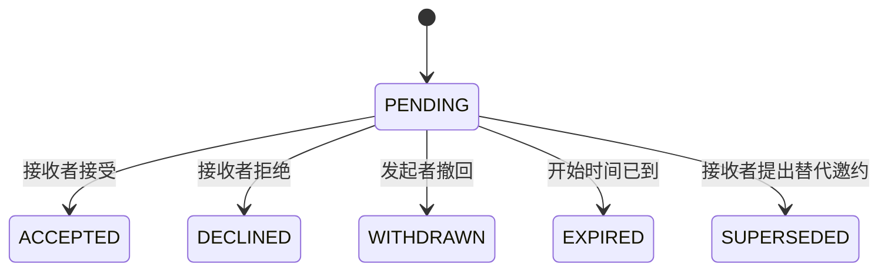
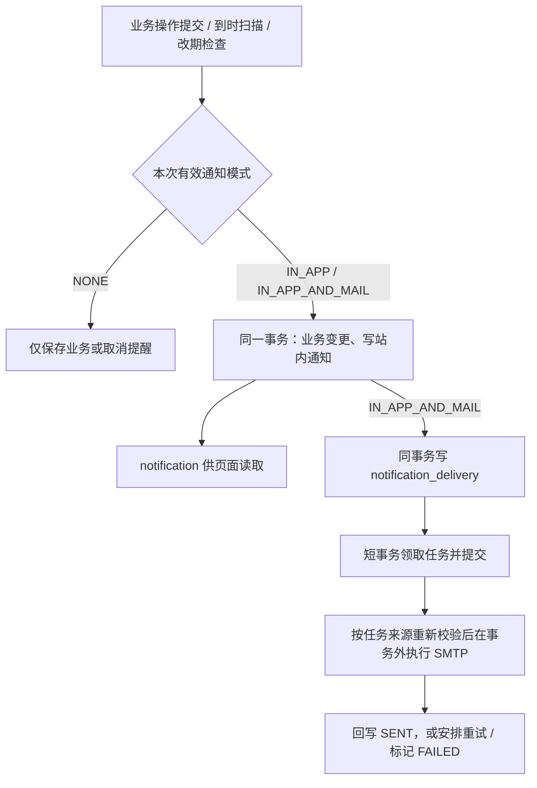

# Usward v1 核心设计

版本：v1.3

日期：2026-09-28

定位：支持单人先用、双人连接的私密关系辅助网站。

本版保留 [UI/API 审计](./ui-api-audit.md) 中 G01–G08 的设计决策与 U01–U08 的交付验收，统一三档通知与发起时的双向通知配置，数据库持久队列同时承接业务通知和私人到时提醒，不引入 RabbitMQ。本文规定正式实现的目标契约；[HTML 预览](../static/UI/README.md) 已同步相应页面交互，但仍使用本地模拟数据，接口路径不代表后端已实现。预览覆盖与边界见 [UI 同步记录](../static/UI/DESIGN-SYNC.md)；初始化 SQL 已同步并纳入新库 Flyway V1，账号 Session 登录与私密卡片个人功能已实现，其余后端模块及真实 SMTP 仍待实现。

## 1. 目标与范围

核心流程：**记住彼此 → 主动安排 → 轻松表达 → 协商确认 → 后续跟进。**

| 目标 | v1 对应能力 |
| --- | --- |
| 减少遗忘与重复解释 | 记忆卡片、搜索、私人提醒 |
| 降低开口成本 | 一键表达、可选补充、简短回应 |
| 为共同时间预留位置 | 个人日历、忙闲展示、邀约协商 |
| 兑现已经答应的事情 | 自己的承诺、截止时间、跟进记录 |
| 一方先用也有效 | 所有个人功能无须绑定即可使用 |

v1 包含账号与双人连接、今日首页、记忆卡片、轻量表达、日历与邀约、承诺、站内提醒，以及用户主动选择的业务邮件通知和邮件到时提醒。

v1 不包含 AI 分析或代回复、关系评分、打卡排行、聊天软件替代、相册或附件、音视频、支付、定位、重复日程规则、外部日历同步、Web Push、多伴侣或群组空间。表达、邀约、分享及相关互动按下文规则选择通知等级；不因进入首页、到达事件开始或承诺截止时间而自动追加通知。共同心愿独立模块延后；暂可记为卡片，不自动视为承诺。

## 2. 用户与空间

### 2.1 账号

- 私人部署，初始配置两个独立账号，不开放公众注册。密码使用 Spring Security 的自适应密码哈希保存。
- 用户可修改自己的昵称、密码、时区和内置头像 `avatarStyle`：`INITIAL`（昵称字，默认）、`FLOWER`（小花）、`SUN`（小太阳）、`SPROUT`（新芽）。昵称字由当前昵称派生，不存图片。显示时区使用 IANA 标识，修改它不会重写既有绝对时间、全天安排时区或日期截止时区。
- Session 登录；修改密码使已有会话失效。部署者通过维护命令重置密码，v1 不实现找回邮件。
- 用户可设置或清空自己的通知收件邮箱 `notificationEmail`，用于接收本人到时提醒及他人互动的邮件通知；不作为登录账号，不向对方公开。私人部署 v1 由本人确认地址，不增加邮箱验证或找回密码流程；更换或清空地址时，取消尚未完成的旧地址邮件任务，不把它们转投新地址。
- 两个账号使用相同功能。产品内没有可以查看对方私密内容的超级账号。

### 2.2 连接

- 未绑定也可使用个人首页、卡片、日程、承诺、提醒。
- 一方生成 24 小时有效的一次性连接邀请，手动交给另一方；对方登录后查看邀请者并主动接受。
- 邀请可撤销；不可自己接受；每个账号同时最多一个有效连接、一个有效待发邀请。重新生成会在同一事务内撤销旧待发邀请。
- 接受时事务锁定相关用户，检查均未绑定，创建连接并消费邀请。邀请只保存口令哈希。创建成功仅返回一次明文口令；刷新后通过 `GET /connection` 读取自己的有效邀请元数据，只能查看有效期、撤销或重新生成，不重显原口令。客户端仅在当前页面内存暂存口令，不持久化。
- 绑定不会共享历史内容；必须逐条主动分享。共享记录绑定具体 `connection_id`，不能只用「当前伴侣」判断。

### 2.3 解除连接

- 任一方可解除，无须另一方批准；操作前明确展示影响并二次确认。
- 解除立即终止旧连接的共享访问、忙闲展示、待处理邀约和跨用户提醒。
- 个人内容保留。原共享卡片和承诺恢复为作者私密，清除分享关系；卡片的补充/更正按撤销分享规则删除。
- 表达与回应、邀约、共同事件作为旧连接内容封存，v1 界面与 API 均不再提供访问；已有共同安排不自动复制给个人。
- 新连接不会继承旧连接内容。站内通知与邮件任务不得绕过以上限制。
- 解除不是删除；数据库备份仍可能保留历史。部署维护说明须明确这一点。

## 3. 页面与交互

手机底部导航：**今天 / 日历 / 表达 / 记忆 / 我的**。承诺入口放在「今天」与「我的」，不另加一级导航。

| 页面 | 主要内容与操作 |
| --- | --- |
| 今天 | 今日日程、待回应邀请和表达、到期承诺、私人关心提醒；快捷记忆、表达、邀约 |
| 日历 | 手机默认日程列表；可切周/月；个人安排、对方忙闲、确认后的共同安排 |
| 表达 | 发出与收到的表达、回应、邀约入口；不显示在线状态或已读回执 |
| 记忆 | 卡片列表、类别/标签筛选、关键词搜索、编辑与分享 |
| 我的 | 承诺清单、通知、账号、通知收件邮箱、时区、忙闲共享、连接与解除 |

交互约束：新增内容默认私密；所有可选字段均可跳过；发送失败保留草稿；未绑定时用可解释的邀请入口替代发送按钮。首页不展示关系成绩或完成率。

所有相关入口复用“不通知 / 站内通知 / 站内通知+邮件通知”选择器。互动发起表单分为“本次通知对方”和“对方回应后通知我”，两项独立，默认均为站内通知；私人提醒未设置时显示“不通知”。通知选择不改变内容可见性、首页分组或业务状态。按钮必须说明通知对象，不能用一个“邮件开关”同时控制双方。

## 4. 记忆卡片

### 4.1 内容

必填：正文。可选：标题、类别、标签、来源类型、来源日期、下次行动、提醒时间及提醒方式。

类别：喜好兴趣、近期关注、相处偏好、明确边界、共同经历、自我反思、其他。

来源类型：

- `EXPLICIT`：对方明确表达，由记录者标记；不代表系统核实。
- `OBSERVED`：亲历事实或自己的经历。
- `INTERPRETATION`：我的理解，待确认；新建默认此项，避免把推测默认写成事实。

### 4.2 操作与可见性

- 创建、编辑、搜索、归档、恢复、删除自己的卡片。
- 主动分享给当前连接；允许撤销分享。分享的是整张当前卡片，分享前展示预览及双向通知配置：本次怎样通知对方、对方补充/更正后怎样通知自己；私人提醒仍不共享。
- 对方只读，可提交「补充/更正」；按作者在本卡片上保存的后续通知方式通知作者。作者自行决定是否修订原文，不能直接改写对方记录；作者修改已分享卡片的内容时，按读取者的后续通知方式通知读取者，归档/恢复不触发此通知。
- 归档只影响作者列表；删除或撤销分享后，对方失去访问，原评论不可再读取。
- 撤销分享时删除依附的补充/更正及本次分享双方的后续通知设置；再次分享重新配置，旧评论、设置和通知任务不恢复。
- 搜索仅覆盖有权读取的卡片；v1 使用 MySQL 条件查询与分页，不引入搜索服务。

## 5. 轻量表达

预设入口：想和你待一会儿、有件事想分享、想一起做件事、刚才有句话让我不舒服、需要一点自己的时间、自由留言。

前五项只选择类型即可发送；自由留言需要正文。可选字段：

- 希望回应时间：有空再看 / 今天聊聊 / 现在方便吗。
- 希望回应方式：听我说 / 一起想办法 / 陪我一下 / 暂时只想告诉你。
- 补充正文。

这些字段表达偏好，不产生必须响应的 SLA、倒计时或自动催促。发送时另选“本次通知对方”和“对方回应后通知我”；回应或追加补充时按接收者在本表达上的后续通知设置处理，双方可分别调整自己的设置。

### 5.1 状态与回应

`OPEN`（待回应）→ `RESPONDED`（已回应）；发送者可将两者撤回为 `WITHDRAWN`。

- 接收者可点选「看到了，晚点找你」「现在方便」「想换个时间」，也可输入自由回应；可继续追加简短回应。
- 发送者可继续补充；只有接收者回应才把 `OPEN` 改为 `RESPONDED`。
- 状态仅说明是否回应，不表示问题解决。发送后正文不直接编辑；内容有误可撤回重发。
- 撤回后保留「已撤回」占位，不再返回正文与回应。
- 需要具体时间时，任一方可从表达发起邀约。创建邀约不自动接受，也不自动形成承诺。
- 一条表达不能自动给对方创建任务。任一方可主动将自己的下一步写入自己的承诺。

## 6. 日历、忙闲与邀约

### 6.1 个人安排

字段：标题、开始/结束时间或全天日期、地点、备注、时间状态、是否分享标题；可见性由忙闲总开关与逐条标题开关共同控制。

时间状态：`BUSY`（正在忙）、`NEGOTIABLE`（可以商量）、`FREE`（有空）。个人备注始终私密。

用户设置「向当前连接展示忙闲」，默认关闭；解除连接时重置为关闭，新连接需重新开启。开启后：

- 所有个人时间块对外仅返回时间、状态与不透明标识；可逐条选择额外分享标题。
- 未安排的时段表示「未标注」，不能推断为有空。
- 关闭忙闲共享后，个人时间块全部停止展示；共同事件仍可见。
- 重叠的个人时间块在对方视图合并，优先级 `BUSY > NEGOTIABLE > FREE`。

前端不展示个人任务优先级，不提供「申请抢占」功能；邀约与调整通过双方协商完成。

### 6.2 邀约状态



- 必填：主题、开始与结束时间；可选地点、说明、关联表达。发起时配置本次通知对方的方式及对方回应后通知自己的方式；从表达发起也重新展示这两项，不隐式继承表达设置。
- 所有邀约均有明确起止时间；全天邀约的日期边界按创建时区判断。
- 接收者只能接受或拒绝当前版本。发起者修改时间或主题应撤回后重新发起。
- 「商量其他时间」原子地结束原提案并创建反向新邀约，用 `previous_invitation_id` 关联；由新接收者确认。双方后续通知设置按用户身份继承，不随发送者/接收者角色交换；本次按新接收者的设置通知，不再重复发送一条“原提案结束”通知。
- 创建邀约接受时在同一事务内创建一条共同事件，并把邀约置为 `ACCEPTED`；同一创建邀约最多一条事件。修改提案接受时只更新目标共同事件。
- 与任一方已有安排冲突时，仅提示冲突时间段，不泄露私密标题；接受方可明确确认仍接受，不硬性拒绝。
- 操作时即刻检查是否已到开始时间；定时过期处理仅为补充，不能依赖扫描及时性。

### 6.3 共同事件与改期

- 共同事件有 `CONFIRMED`、`CANCELLED` 两种状态；过去事件作为历史记录展示，无须打卡。
- 任一方可取消并给出可选说明；提交成功后取消即时生效，按另一方的后续通知设置处理通知。详情向双方返回 `cancellationReason`，取消通知引用该事件；连接有效期间仍可读取取消记录。
- 任一方可提出修改时间、主题、地点或说明；所有共同内容改动均走改期提案，个人提醒可自行修改。CREATE 邀约接受时将双方后续通知设置复制到共同事件；改期提案的双向配置与继承规则见 §11.10。
- 同一事件同时最多一个待处理修改提案；新提案存在时需先撤回、拒绝或处理旧提案。
- 原共同安排在新提案被接受前保持有效。接受后原子替换共同内容并增加版本号；拒绝或撤回不修改原安排。
- 修改提案在「原事件开始」与「新提议开始」中较早者到达时过期，不追溯改写已发生安排。
- 取消事件会同时撤销待处理修改提案。并发操作通过事件行锁、版本号和状态校验保证一致。

### 6.4 对方未使用网站时

用户可记录「线下已确认」的个人安排，说明在微信或当面确认的时间。该条目属于个人日历，界面清楚标记「由我记录，线下确认」，不冒充另一个账号的系统确认。之后绑定也不自动转成共同事件。

## 7. 承诺与提醒

### 7.1 承诺

- 承诺只由履行者为自己创建。必填标题；可选说明、截止日期或精确时间、下一步、关联表达/卡片/事件。截止采用 `dueKind=NONE/DATE/INSTANT`，具体边界见 §11.2；所有页面复用服务端的逾期判定。表达、卡片和事件详情均提供“写下我的下一步”入口，使用同一承诺创建接口和来源引用。
- 默认私密，可主动向当前连接分享；对方只读，不能改截止时间、完成或取消。
- 状态：`OPEN` → `DONE` 或 `CANCELLED`；作者可重新打开为 `OPEN`。
- 完成可填写结果；界面提示「完成记录不代表所有感受已经解决」。不计算恋爱完成率。
- 分享承诺及修改已共享承诺的截止时间、完成、取消或重新打开时，提供“本次通知对方”三档选择，默认站内通知，不要求对方审批。只读方没有回应动作，不展示“对方回应后通知我”；自己的到时提醒独立设置。
- 超过截止时间但未完成仍为 `OPEN`，展示「已过约定时间」，无扣分、排名或重复催促。

### 7.2 提醒与通知

区分用户主动设置的到时提醒，以及业务提交成功时产生的互动通知；二者使用相同三档枚举，但触发时间、接收者和生命周期独立。

| 界面方式 | 模式值 | 触发行为 |
| --- | --- | --- |
| 不通知 | `NONE` | 业务照常保存，不创建站内通知或邮件任务；私人提醒停止有效计划 |
| 站内通知 | `IN_APP` | 生成一条站内通知 |
| 站内通知+邮件通知 | `IN_APP_AND_MAIL` | 生成同一条站内通知，并创建一条邮件投递任务 |

不支持单独邮件。首次发起业务通知的两个方向默认均为 IN_APP，不记住上次操作的选择；共同事件改期从本事件设置初始化，已有内容的后续互动使用接收者保存的设置。私人提醒默认未开启；用户选择 IN_APP 或 IN_APP_AND_MAIL 后必须填写 scheduledAt，不能只选模式而没有时间。

**业务触发与接收者：**

| 功能/动作 | 通知对象及方式 | 本人的后续设置 |
| --- | --- | --- |
| 发出表达、创建邀约、分享卡片 | 当前连接另一方，使用本次 outgoingMode | 保存发起者的 followUpMode；另一方首次默认 IN_APP |
| 表达回应/追加补充、卡片补充/更正、已分享卡片内容修改 | 另一位参与者，读取其在本资源上保存的方式 | 只可调整自己的设置，不覆盖对方 |
| 邀约接受/拒绝/撤回、提出替代时间 | 另一位参与者，读取其在当前邀约上保存的方式 | 替代提案继承双方设置；接受 CREATE 时带入共同事件 |
| 发起共同事件改期提案 | 双向表单初始化为双方在共同事件上的设置；本次 outgoingMode 通知对方 | 发起者可改本提案 followUpMode；不改对方设置 |
| 接受改期、取消共同事件 | 另一位参与者，读取其提案/事件设置 | CHANGE 接受保留事件最新设置，见 §11.10；取消不自动通知自己 |
| 分享承诺、修改已分享承诺截止、完成/取消/重开 | 当前读取者，使用本次 notificationMode，默认 IN_APP | 没有回应设置；私人提醒另设 |
| 改期后的私人提醒检查提示 | 分别发给有 PENDING 提醒者，使用各自提醒的 deliveryMode | 不修改 scheduledAt、deliveryMode 或 revision |

自动邀约过期不新增通知。撤回表达、删除、撤销分享、解除连接不新增指向不可访问内容的通知；邀约撤回记录仍可在当前连接读取，可按设置通知对方。私人记录的普通编辑、首页展示、忙闲展示和账号设置不产生跨用户通知。到期承诺、精选记忆等首页内容不等于已创建通知。

例如 A 发起邀约时选 outgoingMode=IN_APP_AND_MAIL、followUpMode=IN_APP：B 收到站内通知和邮件，B 接受后 A 仅收到站内通知；两项交换则投递方向随之交换。A 的 followUpMode=NONE 时，B 接受仍创建共同事件，但不为本次接受生成给 A 的业务通知。

**私人到时提醒：**

- 每个用户可为自己可访问的一张卡片、一个事件或一条自己的承诺设置一个有效提醒时间。共同事件双方独立设置，提醒与邮箱只对本人可见；承诺截止、事件开始和回应偏好不自动创建提醒。
- “不通知”统一执行取消语义：未设置过不创建提醒行；已有记录取消计划及未完成邮件，保留历史。重新开启须明确提交时间，不恢复旧任务。已触发提醒显示历史状态，不能误显为未来计划；具体接口见 §11.7。
- 每次设置均增加修订号，包括只切换两种有效方式、取消后重设相同时刻；旧修订的未完成提醒邮件及检查提示邮件失效。改期保持原绝对提醒时间，检查提示不消耗或提前触发该提醒。
- 扫描器每分钟分批读取 status=PENDING 且 scheduled_at <= now 的记录；停机后补扫，不限定当前分钟。站内通知、邮件任务及 FIRED 状态同事务提交；FIRED 只表示到时处理已持久化，不表示邮件送达。

站内通知保存在数据库，网页关闭时仍可生成；首页加载、页面重新可见及可见期间每 60 秒刷新未读数，不提供浏览器弹窗。邮件由独立消费者发送，后端、数据库与 SMTP 可用时可在网页关闭期间投递；扫描与排队不保证精确到秒。

邮件选项按实际接收者的邮箱及部署能力校验：发起表单的 outgoingMode 检查对方，followUpMode 检查本人，私人提醒检查本人。只向操作者提供可用状态，不公开对方邮箱。提交前任一所选邮件方向不可用时，保留输入、不提交业务，由用户明确改选后重试；后续互动按对方设置需要邮件但不可用时，允许只对本次明确改为站内或不通知，不修改对方保存的设置（§11.10）。SMTP 连通性不在保存事务内检查；提交后邮件故障不回滚业务或站内通知，也不恢复已触发提醒。

通知仅保存类型、资源引用和通用文案；邮件按类型使用“你收到一条新通知，请登录 Usward 查看”“你设置的提醒已到，请登录 Usward 查看”或“安排有变化，请登录检查自己的提醒”，附网站入口。不含标题、正文、回应、地点、取消说明或免登录凭据；打开后重新鉴权。

失去访问权限时，取消相关 PENDING 提醒、未完成邮件，删除该分享/连接的后续通知设置，将不可访问的旧通知永久标记失效。撤销分享不取消作者仍可使用的私人提醒。共同事件取消、承诺完成/取消时，仅因资源关闭清理到时提醒及提醒检查任务（包括已 FIRED 提醒的未完成邮件）；仍可访问的取消、完成等业务通知及邮件保留。重新打开、分享或连接不恢复旧计划；已发送邮件无法收回。

### 7.3 数据库队列与发送可靠性

**方案可行，适用于当前私人部署、双人使用、低频提醒的规模。** 这是基于本项目规模与一致性需求的架构判断：采用 MySQL 8.4 / InnoDB 持久表作为队列，与现有事务、备份和定时扫描共用基础设施，无须 RabbitMQ。这里的“本地表”是应用数据库表，服务重启后任务仍保留。MySQL 官方明确允许用 `SKIP LOCKED` 降低多个会话访问队列表时的锁竞争。[MySQL 锁定读取文档](https://dev.mysql.com/doc/refman/8.4/en/innodb-locking-reads.html)

通知设置与操作去重记录见 §10；以下三张表负责提醒与投递：`reminder` 保存当前提醒时间、方式与修订；`notification` 保存用户可见的站内通知与已读状态；新增 `notification_delivery` 保存待发送及已处理的邮件任务，作为事务内写入的持久队列。v1 该队列仅有 `channel=MAIL`，同时处理 BUSINESS、REMINDER_DUE、REMINDER_CHECK 三种来源；站内通知在本地事务内生成，已读状态与邮件投递状态互不影响。



处理协议：

1. **事务内生成。** 业务通知按操作回执和接收者去重（§11.10），随业务写入一起提交；NONE 仅保存业务和操作回执。到时扫描先取候选提醒 ID，再按锁顺序重查权限、状态与修订，去重键为 `reminder:<id>:<revision>`，写通知并置 FIRED。改期检查提示的去重键为 `reminder-check:<eventId>:<eventVersion>:<reminderId>:<revision>`，不改变提醒状态。组合模式同时写邮件任务、source_type、关联通知及接收者邮箱快照；仅两种提醒来源填写 reminder_id/reminder_revision，BUSINESS 二者为空。`(notification_id, channel)` 唯一。自动到时或检查提示触发时邮箱/能力缺失，仍生成站内通知并写 FAILED 邮件任务；不能因此阻止已确认的改期。业务通知所需邮件能力在提交前验证，失败则按 §11.10 明确改选，不静默降级。
2. **领取。** 邮件消费者每轮结束后等待 10 秒再启动（fixedDelay），每轮最多处理 20 条，v1 一个发送 worker；使用独立执行器，避免 SMTP 等待阻塞提醒扫描。逐条领取即将发送的任务，不提前领取整批后排队等待。短事务按 `next_attempt_at, id` 读取 `QUEUED` 且已到尝试时间的任务，使用 `FOR UPDATE SKIP LOCKED`；改为 `PROCESSING`，递增 `attempt_count`，写入随机 `lock_token` 与 `lease_until` 后提交。单实例也遵守该协议，重复调度或以后增加实例时可共用。
3. **发送前校验。** 领取事务只锁队列行，结束后再按业务锁顺序校验通知未失效、接收者仍有资源访问权、邮箱快照仍为该接收者当前地址；REMINDER_DUE 还要求资源未关闭且提醒修订匹配、状态为 FIRED，REMINDER_CHECK 要求资源未关闭且修订匹配、状态为 PENDING 或 FIRED，BUSINESS 不要求提醒存在或资源未关闭（取消/完成记录仍可访问）；最后锁任务确认本 worker 仍持有有效租约。失效任务置 `CANCELLED`。同时重查邮件能力仍启用且配置齐全，否则置 `FAILED`，记录 `MAIL_DISABLED/MAIL_CONFIG_INCOMPLETE`。提交后才发送 SMTP，不持有数据库事务等待网络；实际发起前再检查任务未取消与租约有效。
4. **回写。** SMTP 成功接受邮件后，短事务以 `id + status=PROCESSING + lock_token` 且租约仍有效为条件置 `SENT`，记录 `sent_at` 并清空租约。临时失败返回 `QUEUED` 并设置下次尝试时间；明确永久失败或耗尽尝试次数置 `FAILED`。所有失败、续租与回写都校验 token，旧 worker 不得覆盖取消结果或新 worker 的状态。发送成功但数据库回写临时失败时，当前 worker 优先重试回写，不立即重发邮件。
5. **故障恢复。** 租约默认 120 秒，须覆盖一次有界发送；需要延长时仅当前 token 可续租。独立恢复任务每分钟扫描过期的 `PROCESSING`，有剩余次数则重新排队，否则置 `FAILED`，旧 token 失效。网络超时、SMTP 临时拒绝或限流采用退避，默认最多 5 次领取尝试（含首次），失败后间隔 1、5、15、60 分钟，可由部署配置调整；认证凭据错误、明确无效地址等永久失败不反复重试。重试只处理邮件任务，不重新插入站内通知。

任务状态为 `QUEUED → PROCESSING → SENT`，临时失败为 `PROCESSING → QUEUED`；永久失败/次数耗尽为 `FAILED`，失效或用户取消为 `CANCELLED`。`SENT/FAILED/CANCELLED` 是自动处理终态，修复配置不自动重放。只有 `FAILED` 任务可由部署者通过维护命令人工重试，须再次按任务来源检查权限、提醒修订（如有）和邮箱快照，复用原任务并重置尝试次数，不新建站内通知；`SENT/CANCELLED` 不重开。v1 不增加用户批量重发或管理后台。

可靠性边界：

- **站内一次生成，邮件可能重复。** 唯一键和事务可保证同一业务操作/通知类型/接收者、同一到时提醒修订或同一次改期检查各至多一条站内通知与一条邮件任务，但 SMTP 与数据库不能原子提交：邮件已被服务器接受、进程在回写前宕机，或发送结果超时不明时，重新领取可能再次发送。邮件采用允许重复的至少一次尝试语义，并受最大尝试次数限制；不能承诺最终必达或严格只发一次。[RFC 5321 关于超时与重复投递的说明](https://www.rfc-editor.org/rfc/rfc5321.html#section-4.5.3.2.6)
- **接受不等于到达收件箱。** `SENT` 仅表示 SMTP 服务器接受，不能据此判断用户已收到、已读或邮件未进垃圾箱；v1 不处理退信回执。邮件任务失败不回滚站内通知。
- **取消有发送中的边界。** 取消、改邮箱和权限清理在业务事务内将关联 `QUEUED/PROCESSING` 任务置 `CANCELLED` 并清空 token；消费者会再次检查，但检查后与 SMTP 发起之间仍有并发窗口，已开始的发送可能完成。通用邮件不携带私密内容，网站入口始终要求登录并重新鉴权，不能承诺撤销在途邮件。
- **可排查。** 保存尝试次数、下次尝试时间、租约和脱敏失败码，记录队列积压、最老等待时间、失败数量及租约恢复情况。日志不输出密码、授权码、完整收件邮箱或业务正文。v1 保留终态任务用于排查，后续按实际数据量制定归档策略，不清理仍可重试的任务或站内通知去重凭证。

### 7.4 SMTP 配置与接入

后续引入与当前 Spring Boot 版本匹配的 `spring-boot-starter-mail`，由 `JavaMailSender` 发送。用户提供的四项配置放在 `spring.mail` 下；`username/password` 是发信凭据，收件人来自服务端确定的通知接收者的 `notificationEmail`，不能把 SMTP 用户名当作所有用户的收件地址。Spring Boot 提供自动配置，但部分默认超时为无限，需要显式设置。[Spring Boot 4.0 邮件文档](https://docs.spring.io/spring-boot/4.0/reference/io/email.html)

以拟提供的 `smtp.qq.com:465` 为例，配置方案如下；凭据默认留空，实际值通过环境变量提供：

```yaml
spring:
  mail:
    host: ${SMTP_HOST:smtp.qq.com}
    port: ${SMTP_PORT:465}
    username: ${SMTP_USERNAME:}
    password: ${SMTP_PASSWORD:}
    properties:
      "[mail.smtp.auth]": true
      "[mail.smtp.ssl.enable]": true
      "[mail.smtp.ssl.checkserveridentity]": true
      "[mail.smtp.connectiontimeout]": 10000
      "[mail.smtp.timeout]": 10000
      "[mail.smtp.writetimeout]": 10000

app:
  public-base-url: ${PUBLIC_BASE_URL:}
  notifications:
    mail-enabled: ${MAIL_NOTIFICATIONS_ENABLED:false}
```

465 使用隐式 TLS，须显式启用 SSL；若后续改用要求 STARTTLS 的服务商/端口，须相应修改 TLS 属性，不能只改端口。[RFC 8314 的 SMTP 隐式 TLS 规定](https://www.rfc-editor.org/rfc/rfc8314.html#section-3.3) 保留证书与主机名校验，不使用信任所有证书的配置。[Angus Mail SMTP 属性文档](https://eclipse-ee4j.github.io/angus-mail/docs/api/org.eclipse.angus.mail/org/eclipse/angus/mail/smtp/package-summary.html)

`SMTP_PASSWORD` 填服务商要求的 SMTP 凭据；服务商要求授权码时使用授权码。v1 发件人 `From` 使用 `SMTP_USERNAME` 对应的邮箱，须通过服务商验证。`PUBLIC_BASE_URL` 是生产 HTTPS 网站入口。邮件能力默认关闭，缺少凭据或有效网站地址时保持不可用并记录配置原因，站内功能照常；“可用”只表示启用且配置齐全，不代表 SMTP 连通性或最终送达已验证。上线时另行验证认证、TLS 与实际投递，本轮不写入真实凭据或发送邮件。

## 8. 权限矩阵

| 对象 | 本人/作者 | 当前连接另一方 | 未绑定者或其他用户 |
| --- | --- | --- | --- |
| 私密卡片、承诺 | 读写 | 不可见 | 不可见 |
| 分享的卡片 | 读写、撤销分享 | 只读、补充/更正 | 不可见 |
| 分享的承诺 | 读写、撤销分享 | 只读 | 不可见 |
| 个人日程 | 读写 | 仅按忙闲设置返回脱敏信息 | 不可见 |
| 表达 | 发送者补充、撤回 | 接收者回应 | 不可见 |
| 待处理邀约 | 发起者撤回 | 接收者接受、拒绝、替代提议 | 不可见 |
| 共同事件 | 双方只读、提出修改或取消 | 相同 | 不可见 |
| 提醒、通知 | 接收人读取与管理 | 不可见 | 不可见 |
| 资源后续通知设置 | 本人读取与修改 | 仅返回当前动作所需模式及邮件可用性，不公开设置对象、邮箱或投递状态 | 不可见 |

所有共享对象还必须满足其 `connection_id` 正在有效连接中，且调用者是该连接成员。解除连接后，即使持有旧 ID 或深链接也无法访问。

## 9. 技术架构

| 层次 | 选型与职责 |
| --- | --- |
| 前端 | Vue 3、TypeScript、Vite、Vue Router；普通 CSS 与必要组件；FullCalendar 日历 |
| 后端 | Java 21、Spring Boot、Spring Security、MyBatis，模块化单体 |
| 数据 | MySQL 8.4 / InnoDB，Flyway 管理迁移；事务与唯一约束保证核心一致性 |
| 登录 | Session Cookie，Spring Session JDBC 持久化会话；同源 API 与 CSRF 防护 |
| 通知与提醒 | 业务事务按双向设置生成通知；Spring 定时任务扫描 reminder；站内通知与邮件任务同事务落库 |
| 邮件 | notification_delivery 持久队列 + 独立定时消费者 + JavaMailSender / SMTP；不引入 RabbitMQ |
| 部署 | Nginx 提供静态页面、HTTPS 和 `/api` 反代；Docker Compose 启动应用与数据库 |

依赖具体版本在创建工程时确认兼容性并固定。单后端实例即可；数据库不对公网开放。会话 Cookie 设置 `HttpOnly`、生产环境 `Secure` 和适当 `SameSite`；登录、密码修改及邀请兑换有基础限流。

## 10. 核心数据模型

所有业务 ID 使用 BIGINT，JSON 按字符串传输以避免 JavaScript 精度损失。可变对象含 `created_at`、`updated_at`、`version`。时间戳以 UTC 保存；枚举保存可读字符串。文本使用 `utf8mb4`。

| 表 | 核心字段 |
| --- | --- |
| `app_user` | id、username（唯一）、password_hash、nickname、avatar_style、timezone、notification_email（可空，仅本人可见）、active_connection_id、share_availability |
| `pair_connection` | id、user_a_id、user_b_id、status（ACTIVE/ENDED）、ended_at |
| `pair_invite` | id、inviter_id、token_hash（唯一）、expires_at、status、accepted_by |
| `memory_card` | id、owner_id、shared_connection_id（可空）、title、body、category、source_type、source_date、next_action、archived、deleted_at |
| `memory_tag` | card_id、tag；组合唯一 |
| `memory_comment` | id、card_id、connection_id、author_id、body、created_at |
| `expression` | id、connection_id、sender_id、recipient_id、type、body、response_window、response_mode、status |
| `expression_reply` | id、expression_id、author_id、preset、body、created_at |
| `calendar_event` | id、owner_id（个人时必填）、connection_id（共同时必填）、kind、title、时间字段、note/location、availability、share_title、offline_confirmed_at、status、cancellation_reason、pending_change_invitation_id、origin_invitation_id（唯一，可空） |
| `calendar_invitation` | id、connection_id、sender_id、recipient_id、purpose（CREATE/CHANGE）、target_event_id、base_event_version、previous_invitation_id、source_expression_id、提议内容及时间字段、status |
| `commitment` | id、owner_id、shared_connection_id（可空）、title、body、due_kind、due_at、due_date、due_timezone、next_action、status、result、source_type、source_id |
| `reminder` | id、recipient_id、resource_type、resource_id、scheduled_at、delivery_mode（IN_APP/IN_APP_AND_MAIL，默认 IN_APP）、revision、status（PENDING/FIRED/CANCELLED）；资源与接收人组合唯一 |
| `notification_setting` | id、user_id、resource_type、resource_id、connection_id、follow_up_mode（NONE/IN_APP/IN_APP_AND_MAIL，默认 IN_APP）、version；用户与资源组合唯一 |
| `notification_operation` | id、actor_id、idempotency_key、request_hash、action、resource_type、resource_id、result_refs、created_at；actor_id 与 idempotency_key 组合唯一，保存成功操作回执，不保存私密正文 |
| `notification` | id、recipient_id、kind、resource_type、resource_id、message、dedupe_key（唯一）、created_at、read_at、invalidated_at |
| `notification_delivery` | id、notification_id、source_type（BUSINESS/REMINDER_DUE/REMINDER_CHECK）、reminder_id/reminder_revision（BUSINESS 时均为空）、recipient_id、channel（v1 为 MAIL）、to_address（收件地址快照，邮箱缺失的 FAILED 任务可空）、status（QUEUED/PROCESSING/SENT/FAILED/CANCELLED）、attempt_count、next_attempt_at、lock_token、lease_until、sent_at、last_error_code；notification_id 与 channel 组合唯一 |

设计约束：

- `calendar_event.kind` 为 PERSONAL 或 SHARED；两个归属字段恰好满足对应类型约束。
- 安排与邀约的时间结构见 §11.2：`starts_at/ends_at` 与 `start_date/end_date_exclusive` 互斥，均保存 `event_timezone`；`allDay` 由日期字段派生。承诺 `due_kind` 决定互斥截止字段，不把日期精度丢失为一个 UTC 时间戳。
- 承诺的多态来源只是可选引用，读取来源前鉴权；来源不可访问时只显示「来源不可用」，不复制私密原文到共享对象。创建或更换来源时验证调用者有权读取，撤回表达不可用作新来源；详情按当前读取者权限返回 `sourceAvailable`，撤回表达亦视为来源不可用；不能因为承诺已分享而赋予来源访问权。
- 原事件中维护可空 `pending_change_invitation_id`，在事件行锁下保证同时只有一个待处理改期；处理结束清空。
- 两用户有效绑定通过锁定用户行、检查 `active_connection_id` 并原子写入保证；按用户 ID 排序加锁减少死锁。
- 解除连接与跨用户写入均先锁定同一连接行并检查 ACTIVE；解除事务内取消待处理邀约、取消跨用户提醒、恢复作者私密对象。
- 归属、成员、状态条件必须参与查询/更新。软删除、归档和撤回的语义由业务接口控制，不提供任意表字段更新。
- 建立 `(owner_id, updated_at)`、`(shared_connection_id, updated_at)`、`(connection_id, status)`、`(recipient_id, read_at, created_at)`、`(status, scheduled_at)` 等查询索引；日历索引覆盖归属与起止查询。
- 邮件队列增加 `(status, next_attempt_at, id)` 与 `(status, lease_until, id)`，分别用于领取与租约恢复；`(reminder_id, reminder_revision, status)`、`(recipient_id, status)` 支持旧修订取消与邮箱变更清理。关联通知及接收者必须一致；REMINDER_DUE/REMINDER_CHECK 的提醒引用与修订同时非空且属于同一接收者，BUSINESS 的提醒引用必须同时为空；队列不保存 SMTP 密码或私密正文，不对外提供任意入队接口。
- 队列尝试时间、租约生成与过期判断统一使用数据库 UTC 时钟；仅 PROCESSING 状态持有非空 token 与租约，离开该状态时一起清空。QUEUED/PROCESSING 必须有有效收件地址，邮箱缺失的 FAILED 任务不能直接重排或转投新地址；到时提醒需由用户重新设置，业务通知保留失败结果。
- 提醒/通知生成与失效清理按连接、用户、业务资源、通知设置、提醒、通知、投递任务的顺序加锁；队列领取/恢复事务仅锁任务行，提交后才进行业务鉴权，不能持有任务锁反向获取连接或用户锁。过期租约重排仍须下一次发送前重新鉴权，不能恢复已经 CANCELLED 的任务。

### 10.1 数据库同步要求

`static/database/initDatabase.sql` 已包含下列目标字段与表，新库由 Flyway V1 创建。下列清单仍记录了相对早期模型的差异；已有数据库的升级迁移不属于当前新库实施范围：

- `app_user` 新增 `avatar_style`，默认 `INITIAL`，既有用户按默认值回填。
- `commitment` 新增 `due_kind`、`due_date`、`due_timezone`；旧 `due_at` 非空回填 `INSTANT`，为空回填 `NONE`。日期截止保持独立字段，校验互斥组合，并补日期截止查询索引。
- `calendar_event.cancellation_reason`、`pending_change_invitation_id` 与 `notification.message` 已在 SQL 中存在，本次补入模型表；无需重复新增列。
- `notification` 新增可空 `invalidated_at`：撤回、删除、撤销分享或解除使某条通知失去访问权时写入，不因再次分享而清空；用于阻止旧通知复活，查询同时仍需实时鉴权。
- `app_user` 新增可空 `notification_email`，既有用户保持 null，不以登录账号或 SMTP 发件人回填。
- `reminder` 新增 `delivery_mode`，有效计划只保存 IN_APP/IN_APP_AND_MAIL；NONE 通过取消状态表达（§11.7），不创建空时间的有效计划。既有提醒缺失方式时回填 IN_APP，已有显式选择保留，不能迁移后自动开始发送邮件。
- 新增 `notification_setting` 及用户/资源唯一约束；既有有效互动资源的参与者按 IN_APP 初始化（可在首次写入时惰性创建），不推断历史邮件偏好。分享失效或解除连接时删除对应设置，旧连接设置不迁移到新连接。
- 新增 `notification_operation` 及操作者/幂等键唯一约束，为 NONE 操作和资源创建也保留去重依据；该回执不是可见通知，不增加未读数。
- 邮件队列 source_type 必填，历史私人到时任务回填 REMINDER_DUE；reminder_id/reminder_revision 改为按来源可空并增加组合校验。
- 新增 `notification_delivery` 表及上述唯一约束、扫描/恢复/清理索引；既有通知不回溯创建邮件任务。邮箱更改、提醒修订、资源关闭及权限失效按来源清理未完成任务；资源关闭本身不取消仍可读取的业务状态通知。
- 当前预览中仅存于 localStorage 的头像、日期截止等数据不代表已持久化到数据库。后续迁移、DTO 和前端字段需一起验证。

## 11. API 约定与核心接口

前缀 `/api/v1`，JSON 字段 camelCase；ID 和 BIGINT 版本/修订号按十进制字符串传输。正文最长 5000 字、标题最长 100 字，普通回应与评论最长 1000 字。日期使用 `YYYY-MM-DD`，绝对时间使用带 `Z` 的 ISO 8601 UTC 字符串。下文的 `version`、`expectedVersion`、`revision` 均不是客户端自增值。

成功按资源返回 DTO；失败返回 `{code, message, fieldErrors?, details?, traceId}`。未登录返回 401，不可访问资源返回 404，状态或版本冲突返回 409，输入错误返回 400。`details` 仅用于下文定义的脱敏冲突信息、通知不可用方向及改选凭据，不包含底层对象或数据库错误。

| 领域 | 核心接口 |
| --- | --- |
| 登录 | `GET /auth/csrf`、`POST /auth/login`、`POST /auth/logout`、`GET /me`、`PATCH /me`、`POST /me/password` |
| 连接 | `POST /connection-invites`、`POST /connection-invites/preview`、`POST /connection-invites/accept`、`POST /connection-invites/{id}/revoke`、`GET /connection`、`POST /connection/end` |
| 首页 | `GET /dashboard` |
| 记忆 | `GET/POST /memories`、`GET/PATCH/DELETE /memories/{id}`、`POST /memories/{id}/archive`、`POST /memories/{id}/restore`、`POST/DELETE /memories/{id}/share`、`GET/POST /memories/{id}/comments` |
| 表达 | `GET/POST /expressions`、`GET /expressions/{id}`、`POST /expressions/{id}/replies`、`POST /expressions/{id}/withdraw` |
| 日历 | `GET /calendar`、`GET /availability`、`POST /events`、`GET/PATCH/DELETE /events/{id}` |
| 邀约 | `GET/POST /invitations`、`GET /invitations/{id}`、`POST /invitations/{id}/accept`、`.../decline`、`.../counter`、`.../withdraw` |
| 共同改动 | `POST /events/{id}/change-proposals`、`POST /events/{id}/cancel`；修改提案复用邀约处理接口 |
| 承诺 | `GET/POST /commitments`、`GET/PATCH/DELETE /commitments/{id}`、`POST /commitments/{id}/complete`、`.../cancel`、`.../reopen`、`POST/DELETE /commitments/{id}/share` |
| 通知设置 | `GET/PUT /notification-settings/{resourceType}/{resourceId}`、`GET /notification-capabilities` |
| 提醒通知 | `GET/PUT /reminders`、`DELETE /reminders/{id}`、`GET /notifications`、`POST /notifications/{id}/read`、`POST /notifications/read-all` |

`PATCH/DELETE /events/{id}` 仅适用于个人事件；共同事件不能通过这些接口绕过确认。`POST /events` 只能创建自己的个人事件。通用 PATCH 不接受 owner、connection、status 等受控字段。

邀请口令在请求体提交，不进入 URL 查询参数或访问日志。表达预设回应与自由文本走同一回应接口。共享操作按通知模式生成的通知与业务写入同事务。新增 `GET /reminders` 用于完整私人提醒清单；资源详情同时返回自己的提醒。新增批量已读接口以明确跨分页的操作边界，三档与双向配置、能力查询、后续通知设置接口见 §11.10，其余缺口通过已有接口 DTO 补齐。

### 11.1 身份、资料与连接邀请

- `GET /me` 返回 `{id, username, nickname, avatarStyle, timezone, notificationEmail, mailReminderAvailable, shareAvailability, version, stats}`；`stats` 为自己的 `{openCommitmentCount, archivedMemoryCount}` 全量计数。`mailReminderAvailable` 保留既有字段名，表示本人接收业务邮件及私人提醒的能力，由服务端根据邮件启用状态、必需配置及本人有效收件邮箱派生，不接受客户端写入，也不代表 SMTP 连通性已验证。`PATCH /me` 只接受昵称、头像、时区、`notificationEmail`、忙闲开关及 `expectedVersion`；邮箱只接受单个有效地址，null 表示清空，省略表示不修改。地址变化时在同一资料事务内取消本人 `QUEUED/PROCESSING` 邮件任务并使其 token 失效。密码接口接收 `{oldPassword, newPassword}`，校验成功后使包括当前会话在内的已有 Session 失效。
- 公开用户摘要仅含 `{id, nickname, avatarStyle}`；连接、分享者、表达参与者使用该摘要，不返回对方账号、时区、邮箱或完整用户设置。前端不提交 `me/partner` 身份、`signedIn`、owner 或 sender；服务端从 Session 和当前有效连接确定归属及接收者。
- `GET /connection` 返回 `{connection, currentInvite}`。未连接时 `connection=null`；连接时为 `{id, status: ACTIVE, version, members: [公开用户摘要]}`。`currentInvite` 仅为本人未过期的待发邀请 `{id, status: PENDING, expiresAt, version}`，不存在则为 `null`，永不含 token；读取时按当前时间过滤过期记录。对方忙闲共享状态从 §11.5 的 availability DTO 读取。
- `POST /connection-invites` 返回 `{id, token, expiresAt, status, version}`；生成新口令时锁定邀请者并撤销其旧待发邀请。preview 接收 `{token}`，返回 `{id, inviter, expiresAt, version}`；accept 接收 `{token, expectedVersion}`，版本针对预览的邀请，返回连接 DTO。revoke 接收 `{expectedVersion}`；成功返回撤销后的邀请元数据。
- 口令无效返回 `404 INVITE_NOT_FOUND`；口令匹配但过期、已撤销、已使用分别返回 `409 INVITE_EXPIRED/INVITE_REVOKED/INVITE_USED`；自接受为 `400 SELF_INVITE`，任一方已连接为 `409 ALREADY_CONNECTED`。预览不消费口令，接受时重新检查全部条件；成功连接后撤销双方其余待发邀请。未知口令响应不包含邀请者信息。

### 11.2 时间结构与截止精度

安排、邀约及修改提案共用以下时间结构，请求必须完整提供其中一种；切换类型时原类型字段清空，不能同时提交两组非空起止字段：

| 类型 | 请求及响应字段 | 校验与显示 |
| --- | --- | --- |
| 带时间 | `allDay=false, startsAt, endsAt, eventTimezone` | `endsAt > startsAt`；起止为 UTC，时区用于编辑回显；日期字段为 null |
| 全天 | `allDay=true, startDate, endDateExclusive, eventTimezone` | 结束日期大于开始日期；UTC 起止字段为 null；UI 的包含结束日加一个日历日后提交 |

时间范围统一为半开区间 `[start, end)`。全天绝对边界由服务端按 `eventTimezone` 的当地日界转换，不能假设一天总是 24 小时。编辑保留原 `eventTimezone`；只有用户明确更改安排时区才提交新值，共同事件仍须通过提案确认。修改个人显示时区不会触发这种更改。

当地时间输入使用支持 IANA 规则的时区转换。夏令时跳跃中不存在的时间应拒绝并提示重新选择；重复时间必须让用户选择具体偏移后再转 UTC，不静默猜测。日期边界采用该时区该日第一个有效时刻，整日不存在则拒绝该日期。精确截止、提醒与安排使用同一转换规则。

承诺的截止字段采用下列互斥结构，创建默认 `NONE`；PATCH 修改截止时必须提交完整一组：

| `dueKind` | 持久化及 DTO 字段 | 到期/逾期规则 |
| --- | --- | --- |
| `NONE` | `dueAt/dueDate/dueTimezone=null` | 无截止，不逾期 |
| `INSTANT` | `dueAt` 为 UTC；其他两字段 null | `now >= dueAt` 且 `OPEN` 时逾期；显示按用户时区转换 |
| `DATE` | `dueDate` 与 IANA `dueTimezone`；`dueAt=null` | 指定日期全天有效，从该时区下一日的起始边界起逾期；时区在创建截止时固定 |

承诺 DTO 返回派生字段 `deadlineAt`（统一排序边界，无截止为 null）、`isOverdue`、`isDueToday`。`isDueToday` 仅对未逾期的 `OPEN` 承诺成立：精确截止按读取者时区判断当天，日期截止按保存的 `dueTimezone` 判断当天。各次聚合使用同一个服务端 `asOf`，首页不能仅比较日期而忽略精确时刻。日期截止重新编辑仍显示日期模式与原时区；截止任一组成字段变更都按共享承诺截止变更通知处理。

`offlineConfirmedAt` 仅用于个人事件：选中“线下确认”时若未填实际确认时间，以当前时刻生成 UTC 值；编辑已选中的条目保留原值，取消选中提交 null；重新勾选重新记录。服务端不接受 `offline` 演示布尔字段，也不将其当作另一方的系统确认。

### 11.3 资源 DTO 与正式枚举

除下文指定的组合响应或 204 删除响应外，资源详情、创建、编辑和状态操作成功后均返回最新 DTO。可变资源包含 `{id, version, createdAt, updatedAt}`；只追加的回应、评论包含 `{id, authorId, createdAt}`。列表摘要的固定字段见本节后文，不默认附带完整正文、评论或回应历史。可选无值字段返回 null；PATCH 省略字段表示不修改，显式 null 仅可清空可选字段。未知或受控写入字段返回 400，不透传数据库实体。

| 资源 | 核心详情字段与返回边界 |
| --- | --- |
| 记忆 | `ownerId, sharedConnectionId, title, body, category, tags, sourceType, sourceDate, nextAction, archived, myReminder, myNotificationSetting`；`archived` 只向作者返回；分享者摘要仅公开资料 |
| 表达 | `connectionId, senderId, recipientId, type, body, responseWindow, responseMode, status, replyCount, lastReply, replies, myNotificationSetting`；列表含最近回应与全量回应数，详情的 `replies` 按下文分页 |
| 事件 | `kind, ownerId, connectionId, title, location, note, 时间结构, availability, shareTitle, offlineConfirmedAt, status, originInvitationId, pendingChangeInvitationId, cancellationReason, myReminder, myNotificationSetting`；个人详情仅作者可读；共同事件的个人专属字段为 null/false |
| 邀约/修改提案 | `connectionId, senderId, recipientId, purpose, targetEventId, baseEventVersion, previousInvitationId, sourceExpressionId, title, location, note, 时间结构, status, expiresAt, eventId, conflicts, conflictToken, myNotificationSetting`；`expiresAt` 为实际过期边界，接受前 `eventId=null` |
| 承诺 | `ownerId, sharedConnectionId, title, body, nextAction, 截止字段及派生字段, status, result, sourceType, sourceId, sourceAvailable, myReminder`；对方读取时 `myReminder=null`，来源不附带正文 |
| 提醒 | `id, resourceType, resourceId, scheduledAt, deliveryMode, revision, status, version`；只返回当前用户自己的设置 |
| 通知 | `id, kind, resourceType, resourceId, message, createdAt, readAt, mailDelivery`；message 为通用文案，不含标题或私密正文；mailDelivery 无邮件任务时为 null，否则为 `{status, sentAt, failureCode}`，failureCode 仅在 FAILED 时提供脱敏失败码 |

列表与首页复用如下摘要：所有项包含 id；可变资源另含 version、createdAt、updatedAt。记忆摘要含 `ownerId, owner, title, category, tags, sourceType, sharedConnectionId`（owner 为公开用户摘要）；表达摘要含 `senderId, recipientId, type, responseWindow, responseMode, status, replyCount, lastReply`；邀约摘要含 `senderId, recipientId, purpose, title, 时间结构, status, expiresAt, targetEventId, eventId`；承诺摘要含 `ownerId, owner, title, nextAction, status, 截止字段及派生字段, sharedConnectionId`。日历项使用事件 DTO，提醒与通知列表使用各自完整 DTO。精选记忆使用记忆摘要，正文由详情读取；撤回表达始终使用占位 DTO。

下列内容字段之外，通知相关接口仅额外接受 §11.10 明列的 notificationPlan、notificationMode 或通知降级凭据，不接受任意接收者字段。创建/编辑只接受相应业务可写字段：记忆为内容字段和 tags，表达创建为 type/body/responseWindow/responseMode，个人事件为标题/地点/备注/时间结构/availability/shareTitle/offlineConfirmedAt，邀约与修改提案为完整提议内容及可选 sourceExpressionId（仅 CREATE），承诺为标题/说明/下一步/截止字段/来源引用。关联表达须属于当前连接且未撤回。状态、分享关系、派生字段和全部服务端维护的关联 ID 不在通用可写字段中；状态变更走专用接口，承诺 complete 可带 result，reopen 清空旧 result，cancel 不写完成结果。各写入附带下文规定的版本或连接上下文。

`sharedConnectionId` 非空只表示该次分享的连接，读取仍需鉴权；不使用预览里的 `shared` 布尔值代替关系校验。详情可用动作由前端根据当前用户 ID、状态和本文规则推导，服务端每次写入重新校验。通知 `kind` 与资源类型分离，例如 `EVENT_CANCELLED` 引用 `CALENDAR_EVENT`，`REMINDER_DUE` 引用提醒目标；不能使用空资源 ID 的通用系统通知替代业务通知。

`GET /expressions/{id}?replyPage=1&replySize=20` 返回 `replies={items,total,page,size,hasMore}`，按 `createdAt ASC, id ASC` 获取全部历史，最大每页 100；列表不含 `replies`。回应项含 `preset, body`，`lastReply` 为同一结构。撤回后列表和详情只返回 ID、参与者 ID、连接 ID、状态、版本和创建/更新时间的占位，省略类型、偏好、正文、最近回应、数量和回应历史；通知也不得提供内容预览。卡片评论使用已有独立 GET 分页，返回评论正文与作者摘要。

| 字段 | 正式枚举与显示映射 |
| --- | --- |
| `memory.category` | `INTEREST` 喜好兴趣、`RECENT_CONCERN` 近期关注、`RELATIONSHIP_PREFERENCE` 相处偏好、`BOUNDARY` 明确边界、`SHARED_EXPERIENCE` 共同经历、`SELF_REFLECTION` 自我反思、`OTHER` 其他 |
| `memory.sourceType` | `EXPLICIT` 明确表达、`OBSERVED` 亲历事实、`INTERPRETATION` 我的理解（默认） |
| `expression.type` | `SPEND_TIME` 想和你待一会儿、`SHARE_SOMETHING` 有件事想分享、`DO_SOMETHING` 想一起做件事、`HURT_FEELINGS` 刚才有句话让我不舒服、`NEED_SPACE` 需要一点自己的时间、`FREE_TEXT` 自由留言 |
| `responseWindow` | `WHEN_AVAILABLE` 有空再看、`TODAY` 今天聊聊、`NOW` 现在方便吗；可为空 |
| `responseMode` | `LISTEN` 听我说、`THINK_TOGETHER` 一起想办法、`KEEP_COMPANY` 陪我一下、`JUST_TELLING` 暂时只想告诉你；可为空 |
| `reply.preset` | `LATER` 看到了，晚点找你、`AVAILABLE_NOW` 现在方便、`ANOTHER_TIME` 想换个时间；为空时 body 必填，预设可带补充 body；发送者补充使用自由正文 |
| `commitment.sourceType` | `EXPRESSION/MEMORY_CARD/CALENDAR_EVENT`，与 `sourceId` 同时为空或同时提供；按类型打开对应详情 |
| `reminder.resourceType` | `MEMORY_CARD/CALENDAR_EVENT/COMMITMENT`；承诺目标必须属于本人 |
| 通用通知模式 | `NONE` 不通知、`IN_APP` 站内通知、`IN_APP_AND_MAIL` 站内通知+邮件通知；用于 outgoingMode、followUpMode、notificationMode，业务初始默认 IN_APP；不接受 MAIL 单独模式 |
| `reminder.deliveryMode` | PENDING/FIRED 记录为 IN_APP 或 IN_APP_AND_MAIL；三档界面的 NONE 映射为取消，历史 deliveryMode 保留，不表示仍启用 |
| `notification_delivery.sourceType` | `BUSINESS` 业务互动、`REMINDER_DUE` 私人到时提醒、`REMINDER_CHECK` 改期检查提示；这是队列内部分类，不接受客户端指定 |
| `notification.mailDelivery.status` | `QUEUED` 等待发送、`PROCESSING` 正在处理、`SENT` 邮件服务器已接受、`FAILED` 发送失败、`CANCELLED` 已取消；状态不改变站内通知的已读状态 |

### 11.4 列表、筛选与全量统计

普通列表使用 `page`（从 1 开始）、`size`（默认 20，范围 1–100），返回 `{items,total,page,size,hasMore,asOf}`。`total` 是服务端鉴权和全部筛选后的匹配数，`hasMore = page * size < total`；空页也返回 total。先鉴权再筛选、计数、聚合和分页，禁止前端只过滤已加载的一页。`sort` 仅接受下表值，同值统一以 `id` 按主排序方向兜底；非法参数返回 400。

| 列表 | 参数及默认值 | 固定含义、附加返回与排序 |
| --- | --- | --- |
| `GET /memories` | `scope=ALL/MINE/PARTNER`（默认 ALL）、`archived=false`、`keyword`、`category`、`tag`、`sort=UPDATED_DESC` | ALL 为本人未归档 + 对方仍分享卡片；MINE 为本人；PARTNER 为对方仍分享。`archived=true` 仅允许 MINE，作者归档不影响对方结果。keyword 匹配标题/正文，category 与 tag 精确匹配，多个条件取交集；按 updatedAt 倒序 |
| `GET /expressions` | `direction=ALL/RECEIVED/SENT`（默认 ALL）、`status=ALL/OPEN/RESPONDED/WITHDRAWN`（默认 ALL）、`sort=CREATED_DESC` | 当前连接表达，按创建时间倒序；只看待回应传 OPEN |
| `GET /invitations` | `direction=ALL/RECEIVED/SENT`、`status=ALL` 或 §6.2 状态、`purpose=ALL/CREATE/CHANGE`、`sort=CREATED_DESC` | 默认方向、状态与用途 ALL；按创建时间倒序。列表、详情和计数均按读取时刻判定过期，不能等待扫描器 |
| `GET /commitments` | `scope=MINE/PARTNER/ALL`（默认 MINE）、`status=ALL/OPEN/DONE/CANCELLED`（默认 OPEN）、`sort=DEADLINE_ASC/UPDATED_DESC`（默认 DEADLINE_ASC） | 对方仅含仍分享的承诺；截止排序使用 deadlineAt，空截止最后；同截止按 id 升序 |
| `GET /memories/{id}/comments` | `sort=CREATED_ASC` | 按创建时间正序，只返回当前分享轮次的评论 |
| `GET /reminders` | `resourceType` 可省略、`status=ALL/PENDING/FIRED/CANCELLED`（默认 PENDING）、`sort=SCHEDULED_ASC` | 当前用户仍有权访问的目标；按 scheduledAt 升序，取消记录可供查看但不表示有效计划 |
| `GET /notifications` | `read=ALL/UNREAD/READ`（默认 ALL）、`sort=CREATED_DESC` | 当前用户可见通知，附全量 `unreadCount` 与 §11.9 的 `readBoundary`，不受 read 筛选或当前页影响 |

记忆列表额外返回 `availableTags=[{tag,count}]`：在相同 scope、archived、keyword、category 条件下、应用 tag 筛选前，对全部有权读取卡片聚合；一张卡片同一标签只计一次。卡片“再翻 9 张”使用 `size=9`，条件变化后回到第一页。

承诺列表额外返回 `statusCounts={OPEN,DONE,CANCELLED}`，遵循 scope、忽略本次 status 筛选；“对方分享”数量来自 PARTNER 范围的全量计数。普通分页不承诺跨请求快照，写入后应刷新第一页及统计；单次响应内 items、total 和聚合使用一致的读取快照。

### 11.5 日历与忙闲范围

`GET /calendar` 和 `GET /availability` 必须带 `from/to`（UTC 半开范围）及 `timezone`（查询视图的 IANA 时区）。from/to 对应该时区日界，跨度为 1–93 个日历日，不按固定小时数判断；周视图查 7 日，月网格可查 42 日。无交集的记录不返回，有交集的事件返回完整时间结构，供前端裁剪显示。

- calendar 接收 `scope=ALL/MINE/SHARED`（默认 ALL）、`includeCancelled=false`。ALL 仅含本人个人安排与当前连接共同事件，不含对方完整个人事件。设置 includeCancelled=true 可包含共同取消记录；历史日期与未来日期使用相同范围规则。返回 `{items,from,to,timezone,asOf}`，按实际开始边界、id 升序，不用普通列表分页。
- availability 返回 `{sharingEnabled,blocks,from,to,timezone,asOf}`。未连接或对方关闭共享时为 false + 空数组；已开启而无记录为 true + 空数组。服务端合并重叠时间块，按边界切分后取 `BUSY > NEGOTIABLE > FREE`，相邻状态与可公开标题均相同的块可合并；先计算各段允许公开的标题再合并，不能把某一段的标题扩散到其余时段。
- block 仅含 `{opaqueId,startsAt,endsAt,status,title}`，不返回真实事件 ID、备注、地点或 owner 对象。title 仅在该块全部贡献记录都明确 shareTitle 且标题一致时返回，否则 null；opaqueId 不可用于事件详情读取。共同事件直接由 calendar 提供，不重复作为对方忙闲返回。

### 11.6 首页聚合

`GET /dashboard` 以服务端当前时刻和用户时区返回 `{asOf,timezone,today,groups,featuredMemory,unreadCount}`。每个 groups 分组为 `{items,total,hasMore}`，total 为分组全量数量，超过上限显示“查看全部”并使用对应列表筛选；无记录返回空组。

| groups 字段 | 入选范围 | 排序与上限 |
| --- | --- | --- |
| `events` | 与用户今天日界相交的本人个人及当前共同安排，排除取消记录 | 实际开始边界、id 升序，10 条；查看全部跳日历今天 |
| `expressions` | 本人收到且 OPEN 的当前连接表达 | 创建时间、id 倒序，5 条；查看全部用 RECEIVED + OPEN |
| `invitations` | 本人收到且尚未到过期边界的 PENDING 邀约，包含修改提案 | expiresAt、id 升序，5 条；查看全部用 RECEIVED + PENDING |
| `reminders` | 本人全部仍可访问目标上的 PENDING 提醒，包含卡片（含对方分享）、个人/共同事件、自己的承诺；含已到时尚未扫描的计划及未来计划 | scheduledAt、id 升序，5 条；查看全部用 GET /reminders |
| `commitments` | 本人 OPEN 且 isOverdue 或 isDueToday 的承诺 | 逾期优先，其后 deadlineAt、id 升序，5 条；查看全部跳自己的 OPEN 承诺列表 |

首页各组及 featuredMemory 的卡片操作均复用创建/详情表单中的通知配置：表达、邀约提供双向配置，日程/卡片/承诺提供自己的到时三档，分享或状态操作按 §7.2 显示对应选项。NONE 不过滤业务分组；只有取消的提醒退出 reminders 分组。首页加载、刷新、查看详情均不发送通知，unreadCount 只计算实际生成的可见站内通知。

`featuredMemory` 取自己未归档、未删除卡片中 updatedAt 最新的一张摘要（相同则 id 倒序），无记录为 null；它独立于提醒组，不能代替私人提醒聚合。unreadCount 与通知列表使用相同权限过滤与计数规则。未连接时双人分组为空，个人功能照常可用。

### 11.7 私人提醒写入与生命周期

资源详情中的 `myReminder` 返回当前用户那一行提醒（包括 FIRED/CANCELLED），未设置过为 null。详情由此取得刷新后删除所需 ID、修订号与状态；前端只有 PENDING 状态显示为已设置；null/CANCELLED 显示“不通知”，FIRED 显示“已触发”及历史方式，重新设置需明确选方式和时间，不能误显为未来计划。对方分享承诺不能设置提醒。

`PUT /reminders` 接收 `{resourceType,resourceId,scheduledAt,deliveryMode,expectedRevision}`。deliveryMode 省略时兼容为 IN_APP，有效设置只接受 IN_APP/IN_APP_AND_MAIL 且 scheduledAt 必填；界面 NONE 使用下述取消接口，不发送无时间的 PUT。前端编辑时读取并显式提交当前选择。首次设置 expectedRevision 为 null；已有记录必须携带当前 revision。按 §10 的顺序锁定连接（如有）、相关用户、目标资源及该用户资源组合的提醒行，校验目标仍可访问且事件未取消、承诺仍 OPEN。组合方式还须校验本人邮箱及部署邮件能力，未设邮箱返回 `400 RECIPIENT_EMAIL_REQUIRED`，邮件未启用或配置不完整返回 `409 MAIL_NOT_AVAILABLE`；不能静默改成站内方式，也不在保存事务中连接 SMTP。

新行 revision 为 `"1"`，每次成功设置递增并置 PENDING，即使 scheduledAt 与旧值相同或只修改 deliveryMode；同事务取消该提醒旧修订关联的 QUEUED/PROCESSING 邮件任务并使 token 失效，保留已生成且仍有权访问的站内通知。时间可早于当前时刻，届时下一次扫描补触发。修订不匹配返回 `409 REMINDER_REVISION_CONFLICT`，不得覆盖较新的计划。

选择“不通知”或清空已有提醒时间时调用 `DELETE /reminders/{id}`，请求体 `{expectedRevision}`；成功将状态置 CANCELLED 并递增 revision，同事务取消该提醒的到时及检查提示未完成邮件任务并使 token 失效，返回最新提醒 DTO，保留原时间与方式作为历史以供后续查看；未设置过则不调用取消接口、不创建行。该操作也适用于 FIRED 提醒，便于终止已生成但仍在等待/重试的邮件。对已取消记录的当前 revision，或刚执行取消所使用的前一 revision 的重复请求，返回当前取消 DTO；更旧修订或取消后已重设均返回 409。取消不撤回已经生成的站内通知或已经发送的邮件。扫描器在锁内重新鉴权，`reminder:<id>:<revision>` 为通知去重键；扫描和取消并发以事务提交顺序决定本修订是否已触发，邮件发送中的取消边界见 §7.3。

新建卡片、事件或承诺后先取得资源 ID，再 PUT 提醒；资源创建成功但提醒失败时明确显示“内容已保存，提醒未设置”，保留提醒时间与方式并只重试提醒，不再次创建资源。每次 PUT 成功后保存最新 revision；响应丢失时先读取 myReminder 核实修订、时间与方式，不盲目发起新的设置。事件改期不改变 scheduledAt/deliveryMode/revision，按 §7.2 通知双方分别检查。资源关闭、失去访问权的清理与业务变更同事务执行，取消 PENDING 计划时也递增 revision，同时取消相关 FIRED 提醒的未完成到时/检查邮件；仍可访问的业务通知按 §7.2 保留；再次分享、重新打开或重新连接均不自动恢复旧提醒或邮件任务。

收件地址仅在到时创建邮件任务时快照，未来 PENDING 提醒使用届时本人的有效邮箱；更换邮箱不修改提醒时间或方式，已入队任务不转投新地址。若到时邮箱被清空或邮件能力已关闭，站内照常生成，邮件任务标记 FAILED，失败码为 `RECIPIENT_EMAIL_MISSING/MAIL_DISABLED/MAIL_CONFIG_INCOMPLETE`。通知页面按 mailDelivery 展示等待、处理、服务器已接受、失败或取消；配置修复不会自动补发此前 FAILED 任务，站内已读也不取消邮件。

### 11.8 邀约冲突确认、版本与操作结果

邀约详情由服务端计算 `conflicts=[{startsAt,endsAt}]`：与任一方 BUSY/NEGOTIABLE 个人时间块及有效共同事件相交的区间，裁剪到提议范围后合并；FREE、不相交、已取消记录及 CHANGE 的目标原事件自身不计。无论是否开启忙闲共享，该流程只暴露冲突时间，不返回属于谁、状态、标题、备注、真实个人事件 ID 或完整 DTO。只有有权访问该邀约的当前连接成员可取得结果。

详情同时返回短期有效、不含可解码私密数据的 `conflictToken`，绑定调用者、邀约 ID/版本、目标事件版本及本次脱敏区间快照。接受请求的业务字段为 `{expectedVersion,confirmConflicts:false}`（通知降级字段另见 §11.10）；用户看到冲突后明确确认才改为 `{expectedVersion,confirmConflicts:true,conflictToken}`。接受事务在双方日程写入共用的用户锁下重算冲突；存在冲突但未确认，或确认凭据过期、范围变化时，返回 `409 CONFLICT_CONFIRMATION_REQUIRED`，`details={conflicts,conflictToken}`，界面重新展示并确认。没有冲突时不要求 token。个人事件写入、共同事件变更和接受均遵循相同锁协议，避免检查后新增安排绕过确认。

| 写操作 | 期望版本对象及结果 |
| --- | --- |
| 资料、记忆编辑/归档/恢复/分享/撤销分享/删除；承诺编辑/完成/取消/重开/分享/撤销分享/删除 | `expectedVersion` 指被操作资源；成功返回最新资源，删除返回 204 |
| 卡片补充/更正 | `expectedVersion` 指卡片，锁内重新校验本次分享仍有效；成功追加评论并递增卡片版本，返回 `{comment,memoryVersion}` |
| 表达回应/发送者补充/撤回 | `expectedVersion` 指表达；追加回应也递增表达版本，返回 `{reply,expressionVersion,status}`；撤回返回占位 DTO |
| 个人事件 PATCH/DELETE、共同事件取消、创建修改提案 | `expectedVersion` 指事件；创建提案在锁内检查有效并填入 `baseEventVersion`，返回 `{invitation,event}`；取消接收可选 `cancellationReason` 并返回事件 DTO |
| 邀约 accept/decline/withdraw/counter | `expectedVersion` 指当前邀约；CHANGE 另外校验服务端保存的 baseEventVersion 等于目标事件版本 |
| 连接邀请 revoke/accept、解除连接 | 分别校验邀请 version、连接 version；解除成功返回 `{connection:null,currentInvite:null}` |
| 提醒、通知及设置 | 提醒使用 expectedRevision；后续通知设置使用自己的 expectedVersion；通知已读是幂等操作，无须资源 expectedVersion |

创建资源无 expectedVersion；向当前连接新建表达/邀约及分享卡片/承诺时，另传读取到的 `connectionId`，服务端校验它仍是当前有效连接，避免草稿在重连后误发给新连接。其他跨用户操作由既有资源的 connectionId 定位并校验有效性。DELETE 的版本也放请求体，不能因方法不同跳过校验。

事件 `version` 表示内容与状态版本；仅维护 pendingChangeInvitationId 不递增它，否则创建提案本身会使 baseEventVersion 失效。提案指针始终在事件行锁内维护；私人提醒不改变事件版本。CHANGE 的 counter 保留 targetEventId/baseEventVersion，在同一事务替换待处理提案指针；新发送者为原接收者。其过期边界仍为原事件与新提议开始时间较早者。CREATE 的 counter 保留来源表达引用，previousInvitationId 始终由服务端填写。

接受成功返回 `{invitation,event}`；CREATE 创建唯一事件，CHANGE 更新原事件并递增版本。counter 接收新的完整提议内容及 expectedVersion，返回 `{previousInvitation,invitation}`；拒绝/撤回返回最新邀约 DTO。相同接收者重试已 ACCEPTED 邀约时，在鉴权后优先返回当前邀约及已关联事件，不受旧 expectedVersion 影响，不重复创建/改期/通知；若后来已取消，返回当前取消状态事件，不能复活。连接已解除仍返回 404。

其它过期、拒绝、撤回或被替代状态的非法操作返回 `409 INVITATION_EXPIRED/INVALID_STATE`；版本变化返回 `409 VERSION_CONFLICT`，目标事件变化返回 `409 EVENT_VERSION_CONFLICT`；已有未处理改期返回 `409 PENDING_CHANGE_EXISTS`。取消共同事件同时撤销其待处理提案、清空指针、取消双方 PENDING 提醒，并按另一方的后续设置决定是否写入引用该事件的取消通知及邮件任务。全部创建/替代提案须在操作时检查开始及过期边界尚未到达；发现待处理修改提案已过期时，在事件锁内将其置 EXPIRED 并清空指针，再判断是否允许新建，避免扫描延迟阻塞新提案。跨用户事务先锁连接，再按用户 ID 升序锁用户，随后锁业务行；连接邀请在尚无连接时先按 ID 升序锁双方用户并重查绑定，避免不同操作交叉加锁。

### 11.9 通知已读与失败交互

通知列表与 unreadCount 先排除 invalidatedAt 非空记录，再过滤已撤回、删除、失去分享或旧连接等不可访问引用，计算全量未读数；不能把这一页 items 的数量当作未读总数。因失去权限而失效的旧通知不因再次分享或重连而恢复；新一轮分享按本次选择决定是否生成新通知。取消事件在当前连接内仍可访问，取消通知保持可见。首页加载、页面重新可见及可见期间每 60 秒通过 `GET /notifications?read=UNREAD&page=1&size=1` 刷新全量未读数；浏览器不生成正式提醒通知。

`POST /notifications/{id}/read` 只处理当前用户仍可见的通知，重复调用保留首次 readAt，返回该通知。`GET /notifications` 的 `readBoundary` 是服务端签发的当前用户可见通知集合快照凭据；`POST /notifications/read-all` 接收 `{readBoundary}`，仅标记该快照内且操作时仍可访问的未读通知，返回 `{updatedCount,unreadCount}`。快照边界必须记录已提交的通知成员，不能只依赖 MAX(id) 或客户端时间，避免并发事务晚提交的通知被误读；可用短期服务端快照存储成员 ID。凭据失效返回 `409 READ_BOUNDARY_EXPIRED`，需刷新列表后由用户重新操作。批量已读跨越所有页，操作期间新到通知保持未读。

| 失败 | 客户端行为 |
| --- | --- |
| `400 VALIDATION_ERROR` + fieldErrors | 定位字段并保留输入；非法枚举、互斥时间字段同样适用 |
| `400 RECIPIENT_EMAIL_REQUIRED` | 仅本人提醒/后续设置缺邮箱时使用；保留输入，提示设置邮箱或明确改选；对方能力仅用下述通用错误，不透露邮箱 |
| `401 AUTH_REQUIRED` | 按账号隔离保存草稿，重新登录并获取 CSRF；回到原操作后重新读资源和版本，不自动发送 |
| `404 RESOURCE_NOT_FOUND` | 统一显示资源不存在或已不可访问，清除失效的远端内容缓存；来源入口降级为“来源不可用” |
| `409 VERSION_CONFLICT/INVALID_STATE` 等 | 重新获取资源，保留本地输入供核对，不自动覆盖新版本；冲突确认按 §11.8 的独立提示处理 |
| `409 MAIL_NOT_AVAILABLE` | 保留全部业务与通知输入；发起双向配置返回不可用方向 SELF/OTHER，提示明确改选；后续互动降级凭据与重试见 §11.10；不自动降级提交 |
| `409 NOTIFICATION_SETTING_CONFLICT/NOTIFICATION_CONTEXT_CHANGED` | 刷新本人设置或当前操作通知上下文，保留草稿；旧降级凭据不能套用到新版本 |
| `409 IDEMPOTENCY_KEY_REUSED` | 同一幂等键携带不同请求内容，核实原操作后使用新键，不重复提交旧业务 |
| 网络失败或响应不明 | 保留输入；已有资源先刷新确认写入结果，避免自动重复发出表达、评论或创建资源 |

登录前获取 `GET /auth/csrf`，登录后及会话重建后重新获取；所有变更请求携带 CSRF，校验失败返回 `403 CSRF_INVALID`，重新获取后让用户重试。退出登录、切换账号时隔离并清除上一账号的远端缓存；草稿不跨账号显示。导航、分享预览、密码显隐、两步解除确认仍为前端交互，演示数据载入与任意演示密码不进入正式 API。

### 11.10 三档通知、双向配置与后续设置

**发起与后续操作。** 三档枚举见 §7.2；接收者始终由 Session、资源参与者和有效连接推导，客户端不得提交 recipientId、邮箱或队列来源。未绑定的个人内容只有私人提醒入口。首次发起表达、CREATE 邀约或分享卡片的 notificationPlan 省略时，两项均兼容为 IN_APP；改期提案按下表从事件初始化；显式对象须完整提供两项，null 或非法枚举返回 400。

| 写入场景 | 通知请求字段 | 服务端行为 |
| --- | --- | --- |
| POST 表达、CREATE 邀约、卡片分享 | `notificationPlan={outgoingMode,followUpMode}` | outgoingMode 只控制这次发给对方的通知；保存本人的 followUpMode，另一方初始为 IN_APP；只校验本次显式选择的邮件方向 |
| POST 共同事件改期提案 | 同上 | 表单从双方事件设置初始化；省略整个对象时也采用事件设置。对方的事件 followUpMode 复制为其提案设置；只覆盖发起者在本提案的 followUpMode，不修改双方事件设置 |
| 共享承诺的分享、截止编辑、完成/取消/重开 | `notificationMode`（省略为 IN_APP） | 只控制本次发给当前读取者的通知；私密承诺无通知对象，不发送业务通知 |
| 表达回应/补充、卡片评论/已分享内容修改、邀约 accept/decline/withdraw/counter、共同事件 cancel | 正常不传模式；异常改选可传 `notificationOverride={mode,token}` | 读取接收者的 followUpMode；override 仅支持下述邮件不可用时改为 NONE/IN_APP，不能任意提高等级或修改对方设置 |

内容详情（表达、有效分享卡片、邀约、共同事件）增加 `myNotificationSetting={followUpMode,version}`；不适用时为 null；已终结邀约/取消事件可返回本人的历史设置用于解释继承，但不可更新。本人设置与私人 myReminder 独立：前者控制后续互动，后者控制设定时间到达后的提醒。列表和首页摘要无需携带对方设置；打开操作表单时读取最新详情及能力，不以页面旧值决定最终发送。发送者不能读取对方完整设置对象、设置版本、邮箱或投递状态，仅能看到当前动作所需的通知方式与可用性。

**本人后续通知设置。** `GET/PUT /notification-settings/{resourceType}/{resourceId}` 只处理当前登录者；resourceType 限 MEMORY_CARD、EXPRESSION、CALENDAR_INVITATION、CALENDAR_EVENT，且必须是当前有效分享或连接中的参与者（表达不能已撤回）。GET 返回 `{resourceType,resourceId,followUpMode,version}`；尚未持久化的默认设置返回 IN_APP、version=null，读取不创建行。PUT 接收 `{followUpMode,expectedVersion}`，首次为 null，已有行携带其版本；锁内校验资源、连接与设置版本，成功新增版本 "1" 或递增，冲突返回 `409 NOTIFICATION_SETTING_CONFLICT`。设置 IN_APP_AND_MAIL 时验证本人邮箱和邮件能力；NONE 无须邮箱。私人卡片、个人事件及承诺不支持该设置接口，返回 400 VALIDATION_ERROR；不可访问或撤回表达返回 404，已终结邀约/取消事件的 PUT 返回 409 INVALID_STATE，资源正常读取规则不变。

参与者通过详情单独设置自己的接收方式；正常回应不隐式重写任何人的设置。设置修改只影响之后新生成的业务通知，不撤回已生成通知、不取消已提交业务邮件、不补发历史，也不改变资源内容版本。失权清理与私人提醒取消仍按各自规则执行。

**协商继承。** counter 在事务内把双方当时的设置复制到新邀约，本次替代通知使用原邀约中接收者的设置，仅生成一次；角色互换不交换用户归属。CREATE 接受时把双方当前设置复制到新共同事件。CHANGE 提案从事件复制设置，之后提案与事件各自独立；接受 CHANGE 更新共同内容，但保留事件当时最新的双方设置，不用提案快照覆盖事件设置。这样，用户在协商期间调整事件的通知方式不会被接受动作覆盖。已终结邀约不再允许调整设置；重复接受不再次复制。再次分享卡片重新初始化双方设置；从表达创建邀约不继承表达设置。

**能力与明确改选。** `GET /notification-capabilities` 在新发起时接收 connectionId，在已有内容操作时接收 resourceType、resourceId、action（两组互斥）；校验当前连接/访问权/动作后返回 `{selfMailAvailable,otherMailAvailable,effectiveOutgoingMode}`。新发起无既定通知方式时 effectiveOutgoingMode=null，已有互动返回当前动作采用的方式。只返回布尔能力和该次方式，不透露对方邮箱或不可用原因；实际提交在同一业务锁范围内重查，查询结果不能作为承诺。

发起的任一显式邮件方向不可用时返回 `409 MAIL_NOT_AVAILABLE`，details 含 unavailableDirections（SELF/OTHER）；业务、偏好与通知均不提交，保留完整草稿，用户改选后重新提交。本人私人提醒或本人设置未填邮箱仍可使用 `400 RECIPIENT_EMAIL_REQUIRED`。对方能力不可用统一使用通用文案，不要求发送者填写对方邮箱。

后续操作因接收者已保存 IN_APP_AND_MAIL 而无法提交时，同一错误另返回短期不透明 overrideToken，绑定操作者、动作、资源/连接、资源版本及目标通知设置版本。界面明确提供“本次仅站内通知”或“本次不通知”；用户选择后重试并携带 notificationOverride。服务端验证 token 与上下文后，仅覆盖这次 BUSINESS 通知，接收者的设置保持不变；token 失效或上下文变化返回 `409 NOTIFICATION_CONTEXT_CHANGED`，重新读取并由用户确认，不自动重用旧选择。此字段不适用于自动提醒检查任务，也不替代邀约冲突确认。用户已明确改选且上下文未变时，即使邮件恢复可用也按本次选择执行。

提交后配置关闭时，业务和站内通知仍有效，邮件任务按 §7.3 记 FAILED；邮箱更改/清空则按已有规则取消旧地址任务，不转投。改期引发的 REMINDER_CHECK 是依据已保存私人提醒产生的自动提示，邮件不可用只记失败，不阻止改期业务，也不要求操作者处理对方的私人提醒设置。

**事务与幂等。** 上表可能产生业务通知的写入都携带 `Idempotency-Key`（客户端为一次逻辑提交生成 UUID，包括 NONE）。同一操作者、键、接口及请求内容的成功操作保留 notification_operation 回执；在事务内与业务变更、设置初始化/继承、通知及邮件一起提交。并发同键只允许一次执行；响应丢失后用同键重试，经当前权限校验返回已记录结果引用所对应的当前可见资源，不重新执行、不重写偏好、不重新校验邮件能力而要求再发。不同内容复用成功键返回 `409 IDEMPOTENCY_KEY_REUSED`；失败回滚不留成功回执，明确改选后的首次成功提交可继续该逻辑操作。成功后想再发送是新动作，须用新键并满足当前业务状态/版本规则。

BUSINESS 通知去重键为 `business:<operationId>:<kind>:<recipientId>`，一条业务操作可另生成各自独立的改期检查提示，但不能为 counter 或 CHANGE 接受额外重复发送同义业务通知。NONE 也保留操作回执，不能借缺少 notification 行重复创建表达或邀约。v1 保留成功回执和通知去重凭证，不随已读或邮件终态清理；回执仅存请求摘要哈希、操作和结果引用，不存邮箱、令牌或正文。现有 expectedVersion/expectedRevision、冲突确认及权限规则仍生效，幂等键不能绕过它们。

## 12. 交付顺序与验收

### 阶段 A：单人可用

先同步 §10.1 模型和 §11 契约，再交付账号、私密卡片、个人日历、承诺、提醒、今日首页；本阶段即验证头像持久化、日期精度、夏令时和全量分页。

验收：不绑定、不邀请另一方，用户可以记录一件重要的事，设置提醒，重启后仍能收到一次站内提醒，再记录后续行动；所有数据只对自己可见。

### 阶段 B：双人协作

邀请绑定、选择分享、忙闲视图、表达回应、邀约确认、共同改期与取消；同步交付三档业务通知、双向设置和偏好继承，验证不通知不影响内容展示。

验收：A 发送表达，B 回应并发起邀约，A 接受后双方看到同一共同事件；B 提议改期，在 A 接受前原时间不变；任何人无法读取对方未分享的内容。

### 阶段 C：发布可用

解除连接、异常交互、手机适配、备份与恢复说明、SMTP 与收件邮箱配置、业务及到时组合通知发送和核心回归。

验收：

1. 篡改资源 ID、列表筛选、来源引用和通知入口均不能越权。
2. 接受/撤回并发不会重复创建事件；改期/取消并发不会复活已取消事件。
3. 同一提醒修订在重复扫描、服务重启后只生成一条站内通知和至多一条邮件任务；邮件失败与重试不影响站内通知，已撤回内容不再泄露正文。SMTP 重复投递与取消在途发送按 §7.3 的边界验收。
4. 解除连接后旧共同空间立即不可访问，个人内容仍可用，新绑定不会泄露旧内容。
5. 手机可完成核心流程；刷新保留服务端数据，网络失败保留输入，过期会话能重新登录。
6. 数据库定期备份，至少完成一次恢复验证；生产启用 HTTPS，无默认密码或仓库内真实密钥。

### 审计闭环与联调验收清单

以下是正式实现及预览接入时的验收要求。HTML 预览通过的本地模拟测试见 [UI 同步记录](../static/UI/DESIGN-SYNC.md)；正式实现仍须以服务端响应、数据库状态与对应页面结果相互核对，不能以 localStorage 模拟通过替代后端权限或并发验证。

| 审计项 | 设计落点 | 必须验证的场景 |
| --- | --- | --- |
| G01 头像 | §2.1、§10.1、§11.1 | 保存四种头像后刷新与重新登录可回显；对方仅收到公开昵称/头像摘要，不能读取完整账号 |
| G02 日期截止 | §7.1、§10.1、§11.2 | NONE/DATE/INSTANT 分别保存、编辑、清空与排序；日期在保存时区次日边界才逾期，切换显示时区不变精度或边界；旧 UTC 数据迁移为 INSTANT |
| G03 连接邀请 | §2.2、§11.1 | 刷新后可读取有效邀请 ID/有效期并撤销，无明文口令；重新生成使旧口令失效；自接受、过期、已使用和并发绑定按约定返回 |
| G04 提醒闭环 | §7.2、§11.3、§11.7 | 作者/读取者各自设置的提醒只对本人可见；刷新后可按 ID 取消；资源创建成功但提醒失败仅重试提醒；删除、撤销分享、完成、取消、解除后按权限清理 |
| G05 冲突确认 | §11.8 | 对方忙闲开关开/关均仅返回脱敏时间；明确确认可接受；确认前新增冲突要求再次确认；改期排除目标事件自身，不暴露真实个人事件 ID |
| G06 列表聚合 | §11.3–§11.6 | 各列表构造超过 20 条，记忆按每页 9 条加载更多；搜索/标签/方向/状态/全量计数正确；回应历史可逐页读全；作者归档不让对方分享卡片消失；日历 7/42/93 日、半开边界与取消筛选正确 |
| G07 通知已读 | §11.9 | 超过一页未读时 unreadCount 仍为全量；批量已读覆盖快照全部页，期间新提交通知保持未读；失效资源不进入数量，无法借通知读取旧内容 |
| G08 DTO/版本 | §11.1–§11.3、§11.8–§11.9 | ID/版本字符串、正式枚举、两种互斥时间结构及线下确认正确往返；伪造身份、越权来源、陈旧版本均被拒绝；回应/分享/改期分别校验正确对象；接受重试不重复写入，400/401/403/404/409 保留并正确处理输入 |
| U01 夏令时 | §11.2 | 纽约 2026-03-08 03:30 转为 07:30Z、2026-11-01 02:30 转为 07:30Z 且回显原值；纽约与伦敦分别覆盖跳跃时间拒绝、重复时间显式选偏移及跨日界查询 |
| U02 全天时区 | §11.2 | 上海 2026-09-28 全天开始边界为 2026-09-27T16:00Z；改显示时区为纽约后编辑标题再保存，创建时区和边界仍相同；包含结束日与排他结束日可往返 |
| U03 首页提醒 | §11.6 | 只有对方分享卡片、个人/共同事件或承诺上的本人提醒时，首页仍展示；按时间排序且排除 FIRED/CANCELLED，不误称未设置 |
| U04 首页逾期 | §11.2、§11.6 | 上海同日 14:00 精确截止、15:00 查询时，首页与承诺页均为“已过约定时间”；日期截止在整天内不误判 |
| U05 提醒重设 | §11.7 | 同一时刻触发、取消、重设后 revision 增加并产生一次新站内通知；只切换方式也增加修订并取消旧邮件任务；重复扫描、进程重启、陈旧修订与取消并发不重复生成同一修订的站内通知或邮件任务 |
| U06 取消说明 | §6.3、§11.8 | 双方能读取 cancellationReason；非 NONE 时取消通知引用事件并可打开，取消事件可按筛选查询；取消后 pending 提案和双方待发提醒一并清理 |
| U07 改期提示 | §7.2、§11.7 | 仅提议者有提醒、仅接受者有提醒、双方都有提醒分别测试；按各自 PENDING 提醒方式生成检查提示及可选邮件，原提醒时间不变，互不泄露；不因自动检查邮件不可用阻止改期 |
| U08 承诺来源 | §7.1、§10、§11.3 | 表达、卡片和事件均可从详情创建自己的承诺；按 sourceType 打开正确资源；撤回、删源、撤销分享或解除后显示“来源不可用”，对方不能借分享承诺越权 |

上述场景还须覆盖单人未连接流程，以及解除后重新连接同一账号仍无法访问旧表达、邀约、共同事件、分享评论和旧通知。草稿在重新连接后不能自动改发给新连接；浏览器演示身份切换不能替代两个真实 Session 的权限测试。

### 三档通知、双向设置与队列验收清单

以下场景同时指导 HTML 预览和后续正式实现。预览的本地模拟通过不代表已通过真实 SMTP、数据库或并发测试；正式失败与并发场景使用可控制的测试 SMTP 服务，不向真实用户反复发送测试邮件。

| 场景 | 必须验证的结果 |
| --- | --- |
| 三档与首页 | 所有相关入口使用统一标签；NONE 不生成通知/邮件或增加未读数，表达/邀约/日程/承诺/精选记忆仍正常展示；刷新首页不产生通知；私人提醒 NONE 取消计划及未完成提醒邮件 |
| 双向独立 | 邀约本次邮件通知对方、接受后仅站内通知自己；反向组合、任一 NONE、双方 NONE 均按选择执行；两个方向默认 IN_APP，未设置私人提醒默认不通知 |
| 后续互动与继承 | 表达多次回应/补充、卡片补充/内容修改只按接收者设置通知；不能修改对方偏好；counter 按用户继承，CREATE 接受带入事件，CHANGE 接受保留事件最新设置，不用提案快照覆盖，从表达新建邀约不继承 |
| 承诺与取消事件 | 承诺分享、截止变更、完成/取消/重开均可选择通知；无回应开关；事件取消清理到时/检查任务但保留可访问的取消邮件；业务任务无 reminder 引用也能正常发送 |
| 能力与明确改选 | 两个方向分别校验；对方邮箱不暴露；任一所选邮件方向不可用均保留输入且无业务写入；回应降级需有效凭据和显式选择，只影响本次；提示后偏好/资源变化需重新确认 |
| 设置与生命周期 | 改本人 followUpMode 不补发、不重写历史任务；提醒方式改动取消旧修订任务；撤销分享/解除清理偏好和失权任务，重连不继承；改期检查邮件按各自提醒方式且不消耗提醒 |
| 事务与去重 | 在业务写入/设置继承/回执/通知插入/入队/置 FIRED 各处注入回滚，不得部分提交；响应丢失后同幂等键不重复创建或发送（含 NONE），重放不覆盖后来设置；重复扫描/改期提交不重复检查提示；服务重启和历史迁移不回溯发送 |
| 失败与重试 | SMTP 临时故障/限流按退避重试，认证或地址永久错误、次数耗尽标记 FAILED；每次只重试邮件；站内仍可读，通知列表可见脱敏邮件状态 |
| 领取与恢复 | 并发消费者只能领取同一有效租约一次；领取后宕机、SMTP 前宕机可在租约过期后恢复；旧 token 不能续租或回写覆盖新状态，不让一封慢邮件阻塞站内扫描 |
| 发送结果不明 | SMTP 接受后、回写前宕机，以及 SMTP 接受响应丢失时，只保留一条站内通知与邮件任务，允许重试导致邮件重复；SENT 显示为服务器已接受，不误称收件人已读 |
| 修订与取消 | 改时间、只改方式、取消后重设均取消旧任务；FIRED 但邮件仍在队列/重试时可取消；完成承诺/取消事件清理提醒来源任务，删除/撤销分享/解除清理失权任务；仍可访问的业务完成/取消邮件可投递，失效任务不会重新领取，在途发送按约定处理 |
| 邮箱与配置 | 任一实际接收者邮件不可用时拒绝相应组合提交；保存后关闭能力，已成功业务及站内通知保留、邮件明确 FAILED；清空/改邮箱取消旧地址任务，不转投；未来到时缺邮箱记 FAILED；历史缺省方式及后续设置初始化 IN_APP，已有显式选择保留，不自动开启邮件 |
| 隐私与 SMTP | 使用拟提供的 SMTP 配置验证 TLS、认证与实际发送；邮件、任务、日志不包含私密正文或凭据；邮件仅有网站入口，旧连接或撤销分享后经入口仍无法访问原内容 |

## 13. 产品验证标准

实际使用中观察：记录是否足够轻便、是否减少重复提醒、是否帮助主动安排、是否降低表达门槛。通过双方自愿反馈改进，不把点击量、任务完成数或使用频率解释为感情好坏。

v1 的完整性由上述用户流程、权限与数据可靠性判断；允许双方使用频率不同，也允许一方长期只使用个人功能。
