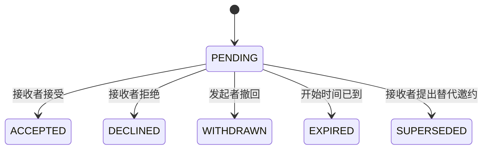

# Usward v1 核心设计

版本：v1.0  
日期：2026-09-26  
定位：支持单人先用、双人连接的私密关系辅助网站。

## 1. 目标与范围

核心流程：**记住彼此 → 主动安排 → 轻松表达 → 协商确认 → 后续跟进。**

| 目标 | v1 对应能力 |
| --- | --- |
| 减少遗忘与重复解释 | 记忆卡片、搜索、私人提醒 |
| 降低开口成本 | 一键表达、可选补充、简短回应 |
| 为共同时间预留位置 | 个人日历、忙闲展示、邀约协商 |
| 兑现已经答应的事情 | 自己的承诺、截止时间、跟进记录 |
| 一方先用也有效 | 所有个人功能无须绑定即可使用 |

v1 包含账号与双人连接、今日首页、记忆卡片、轻量表达、日历与邀约、承诺、站内提醒。

v1 不包含 AI 分析或代回复、关系评分、打卡排行、聊天软件替代、相册或附件、音视频、支付、定位、重复日程规则、外部日历同步、邮件或 Web Push、多伴侣或群组空间。共同心愿独立模块延后；暂可记为卡片，不自动视为承诺。

## 2. 用户与空间

### 2.1 账号

- 私人部署，初始配置两个独立账号，不开放公众注册。密码使用 Spring Security 的自适应密码哈希保存。
- 用户可修改自己的昵称、密码、时区；头像使用内置样式。
- Session 登录；修改密码使已有会话失效。部署者通过维护命令重置密码，v1 不实现找回邮件。
- 两个账号使用相同功能。产品内没有可以查看对方私密内容的超级账号。

### 2.2 连接

- 未绑定也可使用个人首页、卡片、日程、承诺、提醒。
- 一方生成 24 小时有效的一次性连接邀请，手动交给另一方；对方登录后查看邀请者并主动接受。
- 邀请可撤销；不可自己接受；每个账号同时最多一个有效连接。
- 接受时事务锁定相关用户，检查均未绑定，创建连接并消费邀请。邀请只保存口令哈希。
- 绑定不会共享历史内容；必须逐条主动分享。共享记录绑定具体 `connection_id`，不能只用「当前伴侣」判断。

### 2.3 解除连接

- 任一方可解除，无须另一方批准；操作前明确展示影响并二次确认。
- 解除立即终止旧连接的共享访问、忙闲展示、待处理邀约和跨用户提醒。
- 个人内容保留。原共享卡片和承诺恢复为作者私密，清除分享关系。
- 表达与回应、邀约、共同事件作为旧连接内容封存，v1 界面与 API 均不再提供访问；已有共同安排不自动复制给个人。
- 新连接不会继承旧连接内容。站内通知不得绕过以上限制。
- 解除不是删除；数据库备份仍可能保留历史。部署维护说明须明确这一点。

## 3. 页面与交互

手机底部导航：**今天 / 日历 / 表达 / 记忆 / 我的**。承诺入口放在「今天」与「我的」，不另加一级导航。

| 页面 | 主要内容与操作 |
| --- | --- |
| 今天 | 今日日程、待回应邀请和表达、到期承诺、私人关心提醒；快捷记忆、表达、邀约 |
| 日历 | 手机默认日程列表；可切周/月；个人安排、对方忙闲、确认后的共同安排 |
| 表达 | 发出与收到的表达、回应、邀约入口；不显示在线状态或已读回执 |
| 记忆 | 卡片列表、类别/标签筛选、关键词搜索、编辑与分享 |
| 我的 | 承诺清单、通知、账号、时区、忙闲共享、连接与解除 |

交互约束：新增内容默认私密；所有可选字段均可跳过；发送失败保留草稿；未绑定时用可解释的邀请入口替代发送按钮。首页不展示关系成绩或完成率。

## 4. 记忆卡片

### 4.1 内容

必填：正文。可选：标题、类别、标签、来源类型、来源日期、下次行动、提醒时间。

类别：喜好兴趣、近期关注、相处偏好、明确边界、共同经历、自我反思、其他。

来源类型：

- `EXPLICIT`：对方明确表达，由记录者标记；不代表系统核实。
- `OBSERVED`：亲历事实或自己的经历。
- `INTERPRETATION`：我的理解，待确认；新建默认此项，避免把推测默认写成事实。

### 4.2 操作与可见性

- 创建、编辑、搜索、归档、恢复、删除自己的卡片。
- 主动分享给当前连接；允许撤销分享。分享的是整张当前卡片，分享前展示预览，私人提醒仍不共享。
- 对方只读，可提交「补充/更正」；作者自行决定是否修订原文，不能直接改写对方记录。
- 归档只影响作者列表；删除或撤销分享后，对方失去访问，原评论不可再读取。
- 撤销分享时删除依附的补充/更正；再次分享作为新一轮分享，旧评论不恢复。
- 搜索仅覆盖有权读取的卡片；v1 使用 MySQL 条件查询与分页，不引入搜索服务。

## 5. 轻量表达

预设入口：想和你待一会儿、有件事想分享、想一起做件事、刚才有句话让我不舒服、需要一点自己的时间、自由留言。

前五项只选择类型即可发送；自由留言需要正文。可选字段：

- 希望回应时间：有空再看 / 今天聊聊 / 现在方便吗。
- 希望回应方式：听我说 / 一起想办法 / 陪我一下 / 暂时只想告诉你。
- 补充正文。

这些字段表达偏好，不产生必须响应的 SLA、倒计时或自动催促。

### 5.1 状态与回应

`OPEN`（待回应）→ `RESPONDED`（已回应）；发送者可将两者撤回为 `WITHDRAWN`。

- 接收者可点选「看到了，晚点找你」「现在方便」「想换个时间」，也可输入自由回应；可继续追加简短回应。
- 发送者可继续补充；只有接收者回应才把 `OPEN` 改为 `RESPONDED`。
- 状态仅说明是否回应，不表示问题解决。发送后正文不直接编辑；内容有误可撤回重发。
- 撤回后保留「已撤回」占位，不再返回正文与回应。
- 需要具体时间时，任一方可从表达发起邀约。创建邀约不自动接受，也不自动形成承诺。
- 一条表达不能自动给对方创建任务。任一方可主动将自己的下一步写入自己的承诺。

## 6. 日历、忙闲与邀约

### 6.1 个人安排

字段：标题、开始/结束时间或全天日期、备注、时间状态、可见性。

时间状态：`BUSY`（正在忙）、`NEGOTIABLE`（可以商量）、`FREE`（有空）。个人备注始终私密。

用户设置「向当前连接展示忙闲」，默认关闭。开启后：

- 所有个人时间块对外仅返回时间、状态与不透明标识；可逐条选择额外分享标题。
- 未安排的时段表示「未标注」，不能推断为有空。
- 关闭忙闲共享后，个人时间块全部停止展示；共同事件仍可见。
- 重叠的个人时间块在对方视图合并，优先级 `BUSY > NEGOTIABLE > FREE`。

前端不展示个人任务优先级，不提供「申请抢占」功能；邀约与调整通过双方协商完成。

### 6.2 邀约状态

- 必填：主题、开始与结束时间；可选地点、说明、关联表达。
- 所有邀约均有明确起止时间；全天邀约的日期边界按创建时区判断。
- 接收者只能接受或拒绝当前版本。发起者修改时间或主题应撤回后重新发起。
- 「商量其他时间」原子地结束原提案并创建反向新邀约，用 `previous_invitation_id` 关联；由新接收者确认。
- 接受时在同一事务内创建一条共同事件，并把邀约置为 `ACCEPTED`；同一邀约最多一条事件。
- 与任一方已有安排冲突时，仅提示冲突时间段，不泄露私密标题；接受方可明确确认仍接受，不硬性拒绝。
- 操作时即刻检查是否已到开始时间；定时过期处理仅为补充，不能依赖扫描及时性。

### 6.3 共同事件与改期

- 共同事件有 `CONFIRMED`、`CANCELLED` 两种状态；过去事件作为历史记录展示，无须打卡。
- 任一方可取消并给出可选说明；取消即时生效，通知另一方。
- 任一方可提出修改时间、主题、地点或说明；所有共同内容改动均走改期提案，个人提醒可自行修改。
- 同一事件同时最多一个待处理修改提案；新提案存在时需先撤回、拒绝或处理旧提案。
- 原共同安排在新提案被接受前保持有效。接受后原子替换共同内容并增加版本号；拒绝或撤回不修改原安排。
- 修改提案在「原事件开始」与「新提议开始」中较早者到达时过期，不追溯改写已发生安排。
- 取消事件会同时撤销待处理修改提案。并发操作通过事件行锁、版本号和状态校验保证一致。

### 6.4 对方未使用网站时

用户可记录「线下已确认」的个人安排，说明在微信或当面确认的时间。该条目属于个人日历，界面清楚标记「由我记录，线下确认」，不冒充另一个账号的系统确认。之后绑定也不自动转成共同事件。

## 7. 承诺与提醒

### 7.1 承诺

- 承诺只由履行者为自己创建。必填标题；可选说明、截止时间、下一步、关联表达/卡片/事件。
- 默认私密，可主动向当前连接分享；对方只读，不能改截止时间、完成或取消。
- 状态：`OPEN` → `DONE` 或 `CANCELLED`；作者可重新打开为 `OPEN`。
- 完成可填写结果；界面提示「完成记录不代表所有感受已经解决」。不计算恋爱完成率。
- 修改已共享承诺的截止时间、取消或重新打开时，给对方一条站内变更通知，不要求对方审批。
- 超过截止时间但未完成仍为 `OPEN`，展示「已过约定时间」，无扣分、排名或重复催促。

### 7.2 提醒与通知

区分两类信息：用户主动设置的到时提醒，以及表达、邀约等操作产生的站内通知。

- 每个用户可为自己可访问的一张卡片、一个事件或一条自己的承诺设置一个有效提醒时间。
- 提醒只有本人能看见；共同事件双方各自设置，互不影响。
- v1 仅站内通知，网页关闭后不保证送达；首页加载及页面可见时每 60 秒刷新未读数量。
- 扫描器每分钟读取所有已到期且未处理提醒，生成一次通知；停机后补扫，不限定「当前分钟」。
- 通知插入、提醒状态变更同事务；唯一去重键避免重试重复。数据库事务提交前不执行外部发送。
- 用户编辑提醒增加修订号；旧计划失效。提醒时间为绝对时间，事件改期后提示用户检查，不自动猜测新提醒时间。
- 通知仅保存类型、资源引用和通用文案，私密正文在打开时重新鉴权后读取。
- 内容撤回、删除、撤销分享或解除连接后，取消相关未发送提醒，隐藏不可访问的旧通知。

## 8. 权限矩阵

| 对象 | 本人/作者 | 当前连接另一方 | 未绑定者或其他用户 |
| --- | --- | --- | --- |
| 私密卡片、承诺 | 读写 | 不可见 | 不可见 |
| 分享的卡片 | 读写、撤销分享 | 只读、补充/更正 | 不可见 |
| 分享的承诺 | 读写、撤销分享 | 只读 | 不可见 |
| 个人日程 | 读写 | 仅按忙闲设置返回脱敏信息 | 不可见 |
| 表达 | 发送者补充、撤回 | 接收者回应 | 不可见 |
| 待处理邀约 | 发起者撤回 | 接收者接受、拒绝、替代提议 | 不可见 |
| 共同事件 | 双方只读、提出修改或取消 | 相同 | 不可见 |
| 提醒、通知 | 接收人读取与管理 | 不可见 | 不可见 |

所有共享对象还必须满足其 `connection_id` 正在有效连接中，且调用者是该连接成员。解除连接后，即使持有旧 ID 或深链接也无法访问。

## 9. 技术架构

| 层次 | 选型与职责 |
| --- | --- |
| 前端 | Vue 3、TypeScript、Vite、Vue Router；普通 CSS 与必要组件；FullCalendar 日历 |
| 后端 | Java 21、Spring Boot、Spring Security、MyBatis，模块化单体 |
| 数据 | MySQL，Flyway 管理迁移；事务与唯一约束保证核心一致性 |
| 登录 | Session Cookie，Spring Session JDBC 持久化会话；同源 API 与 CSRF 防护 |
| 提醒 | Spring 定时任务 + 数据库到期扫描 |
| 部署 | Nginx 提供静态页面、HTTPS 和 `/api` 反代；Docker Compose 启动应用与数据库 |

依赖具体版本在创建工程时确认兼容性并固定。单后端实例即可；数据库不对公网开放。会话 Cookie 设置 `HttpOnly`、生产环境 `Secure` 和适当 `SameSite`；登录、密码修改及邀请兑换有基础限流。

## 10. 核心数据模型

所有业务 ID 使用 BIGINT，JSON 按字符串传输以避免 JavaScript 精度损失。可变对象含 `created_at`、`updated_at`、`version`。时间戳以 UTC 保存；枚举保存可读字符串。文本使用 `utf8mb4`。

| 表 | 核心字段 |
| --- | --- |
| `app_user` | id、username（唯一）、password_hash、nickname、timezone、active_connection_id、share_availability |
| `pair_connection` | id、user_a_id、user_b_id、status（ACTIVE/ENDED）、ended_at |
| `pair_invite` | id、inviter_id、token_hash（唯一）、expires_at、status、accepted_by |
| `memory_card` | id、owner_id、shared_connection_id（可空）、title、body、category、source_type、source_date、next_action、archived、deleted_at |
| `memory_tag` | card_id、tag；组合唯一 |
| `memory_comment` | id、card_id、connection_id、author_id、body、created_at |
| `expression` | id、connection_id、sender_id、recipient_id、type、body、response_window、response_mode、status |
| `expression_reply` | id、expression_id、author_id、preset、body、created_at |
| `calendar_event` | id、owner_id（个人时必填）、connection_id（共同时必填）、kind、title、时间字段、note/location、availability、share_title、offline_confirmed_at、status、origin_invitation_id（唯一，可空） |
| `calendar_invitation` | id、connection_id、sender_id、recipient_id、purpose（CREATE/CHANGE）、target_event_id、base_event_version、previous_invitation_id、source_expression_id、提议内容及时间字段、status |
| `commitment` | id、owner_id、shared_connection_id（可空）、title、body、due_at、next_action、status、result、source_type、source_id |
| `reminder` | id、recipient_id、resource_type、resource_id、scheduled_at、revision、status（PENDING/FIRED/CANCELLED）；资源与接收人组合唯一 |
| `notification` | id、recipient_id、kind、resource_type、resource_id、dedupe_key（唯一）、created_at、read_at |

设计约束：

- `calendar_event.kind` 为 PERSONAL 或 SHARED；两个归属字段恰好满足对应类型约束。
- 带时间对象存 `starts_at/ends_at`；全天对象存 `start_date/end_date_exclusive/event_timezone`，二者互斥。
- 承诺的多态来源只是可选引用，读取来源前鉴权；来源不可访问时只显示「来源不可用」，不复制私密原文到共享对象。
- 原事件中维护可空 `pending_change_invitation_id`，在事件行锁下保证同时只有一个待处理改期；处理结束清空。
- 两用户有效绑定通过锁定用户行、检查 `active_connection_id` 并原子写入保证；按用户 ID 排序加锁减少死锁。
- 解除连接与跨用户写入均先锁定同一连接行并检查 ACTIVE；解除事务内取消待处理邀约、取消跨用户提醒、恢复作者私密对象。
- 归属、成员、状态条件必须参与查询/更新。软删除、归档和撤回的语义由业务接口控制，不提供任意表字段更新。
- 建立 `(owner_id, updated_at)`、`(shared_connection_id, updated_at)`、`(connection_id, status)`、`(recipient_id, read_at, created_at)`、`(status, scheduled_at)` 等查询索引；日历索引覆盖归属与起止查询。

## 11. API 约定与核心接口

前缀 `/api/v1`，JSON 字段 camelCase。列表默认 20 条、最多 100 条；日历查询必须带起止范围，单次最多 93 天。正文最长 5000 字、标题最长 100 字；普通回应与评论最长 1000 字。

成功按资源返回 DTO；失败返回 `{code, message, fieldErrors?, traceId}`。未登录返回 401，不可访问资源返回 404，状态或版本冲突返回 409，输入错误返回 400。共享写操作携带 `expectedVersion`。

| 领域 | 核心接口 |
| --- | --- |
| 登录 | `GET /auth/csrf`、`POST /auth/login`、`POST /auth/logout`、`GET /me`、`PATCH /me`、`POST /me/password` |
| 连接 | `POST /connection-invites`、`POST /connection-invites/preview`、`POST /connection-invites/accept`、`POST /connection-invites/{id}/revoke`、`GET /connection`、`POST /connection/end` |
| 首页 | `GET /dashboard` |
| 记忆 | `GET/POST /memories`、`GET/PATCH/DELETE /memories/{id}`、`POST /memories/{id}/archive`、`POST /memories/{id}/restore`、`POST/DELETE /memories/{id}/share`、`GET/POST /memories/{id}/comments` |
| 表达 | `GET/POST /expressions`、`GET /expressions/{id}`、`POST /expressions/{id}/replies`、`POST /expressions/{id}/withdraw` |
| 日历 | `GET /calendar`、`GET /availability`、`POST /events`、`GET/PATCH/DELETE /events/{id}` |
| 邀约 | `GET/POST /invitations`、`GET /invitations/{id}`、`POST /invitations/{id}/accept`、`.../decline`、`.../counter`、`.../withdraw` |
| 共同改动 | `POST /events/{id}/change-proposals`、`POST /events/{id}/cancel`；修改提案复用邀约处理接口 |
| 承诺 | `GET/POST /commitments`、`GET/PATCH/DELETE /commitments/{id}`、`POST /commitments/{id}/complete`、`.../cancel`、`.../reopen`、`POST/DELETE /commitments/{id}/share` |
| 提醒通知 | `PUT /reminders`、`DELETE /reminders/{id}`、`GET /notifications`、`POST /notifications/{id}/read` |

`PATCH/DELETE /events/{id}` 仅适用于个人事件；共同事件不能通过这些接口绕过确认。`POST /events` 只能创建自己的个人事件。通用 PATCH 不接受 owner、connection、status 等受控字段。

邀请口令在请求体提交，不进入 URL 查询参数或访问日志。表达预设回应与自由文本走同一回应接口。重复接受已被同一接收者接受的邀约返回已有事件；已被撤回、拒绝或过期则返回 409。共享操作的成功通知与业务写入同事务。

## 12. 交付顺序与验收

### 阶段 A：单人可用

账号、私密卡片、个人日历、承诺、提醒、今日首页。

验收：不绑定、不邀请另一方，用户可以记录一件重要的事，设置提醒，重启后仍能收到一次站内提醒，再记录后续行动；所有数据只对自己可见。

### 阶段 B：双人协作

邀请绑定、选择分享、忙闲视图、表达回应、邀约确认、共同改期与取消。

验收：A 发送表达，B 回应并发起邀约，A 接受后双方看到同一共同事件；B 提议改期，在 A 接受前原时间不变；任何人无法读取对方未分享的内容。

### 阶段 C：发布可用

解除连接、异常交互、手机适配、备份与恢复说明、部署配置和核心回归。

验收：

1. 篡改资源 ID、列表筛选、来源引用和通知入口均不能越权。
2. 接受/撤回并发不会重复创建事件；改期/取消并发不会复活已取消事件。
3. 提醒重复扫描、服务重启不会产生重复通知；已撤回内容不再泄露正文。
4. 解除连接后旧共同空间立即不可访问，个人内容仍可用，新绑定不会泄露旧内容。
5. 手机可完成核心流程；刷新保留服务端数据，网络失败保留输入，过期会话能重新登录。
6. 数据库定期备份，至少完成一次恢复验证；生产启用 HTTPS，无默认密码或仓库内真实密钥。

## 13. 产品验证标准

实际使用中观察：记录是否足够轻便、是否减少重复提醒、是否帮助主动安排、是否降低表达门槛。通过双方自愿反馈改进，不把点击量、任务完成数或使用频率解释为感情好坏。

v1 的完整性由上述用户流程、权限与数据可靠性判断；允许双方使用频率不同，也允许一方长期只使用个人功能。
